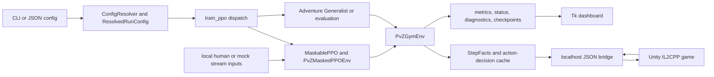

# PvZRL Agent Operating Guide

This file is the root-level operating contract for automated contributors. It applies to the entire repository. Read it before changing code, configuration, tests, documentation, bridge binaries, model artifacts, or live-game state. If a narrower `AGENTS.md` is added later, it may refine rules only for its subtree.

## 1. Project overview and boundaries

PvZRL is a local Windows research and automation system for `PlantsVsZombiesRH`. Python owns environment logic, Stable-Baselines3/`sb3-contrib` MaskablePPO integration, Adventure progression, rewards, diagnostics, local coach inputs, artifacts, and a Tk dashboard. A MelonLoader C# bridge runs inside the bundled Unity/IL2CPP game and exposes local newline-delimited JSON commands to Python.

Implemented and maintained here:

- fixed four-slot PPO training/evaluation and 14-slot Adventure Generalist training/evaluation;
- Gymnasium environments, action masks, observation encoding, reward composition, lifecycle/reset handling, and model compatibility checks;
- local human-coach, mock-stream/crowd-coach, assisted-coach, and Tk dashboard workflows;
- a localhost-only C# bridge for observation, configuration, seed/UI automation, placement, fusion, reset, and runtime dispatch;
- JSON/JSONL/CSV/TensorBoard/checkpoint/live-status/watchdog artifacts under gitignored run directories;
- bridge-free regression suites, deterministic C# harnesses, and synthetic performance benchmarks.

Not implemented and not implied by names such as “stream coach”:

- no production website, FastAPI service, hosted API, remote control plane, or public streaming integration;
- no public network listener or multi-user service; the bridge binds only to `127.0.0.1`;
- no deployment pipeline, cloud environment, production database, or remote secret store;
- no guarantee that an arbitrary game/mod version, profile, checkpoint, or seed bank is compatible.

Keep the system local and source-first. Do not add a web/service architecture to solve a local file, Tk, subprocess, or bridge problem unless the user explicitly changes the product boundary.

## 2. Authoritative repository map

| Area | Authoritative paths | Ownership and constraints |
| --- | --- | --- |
| Training dispatch | `python/train_ppo.py`, `python/pvzrl_config.py`, `docs/CONFIGURATION.md` | CLI/JSON resolution, run-mode dispatch, compatibility flat dictionary, fixed/Generalist training entrypoints. |
| Evaluation dispatch | `python/train_ppo.py`, `python/pvzrl_adventure.py`, `python/pvzrl_adventure_generalist.py` | Fixed evaluation, Adventure evaluation, protected-model compatibility/load, and per-attempt orchestration. |
| Base environment | `python/pvzrl_env.py`, `python/pvzrl_lifecycle.py`, `python/pvzrl_runtime_state.py` | Bridge client, reset/state machine, action execution boundary, lifecycle classification, current frame/state. |
| SB3 adapter | `python/pvzrl_sb3.py` | Gym spaces, numeric observation, masks, coach arbitration, episode accounting, MaskablePPO-facing behavior. |
| Action contract | `python/pvzrl_action_space.py`, `python/pvzrl_actions.py` | Decoder layouts, immutable intents/decisions/results, legality, per-frame action-decision cache. |
| Observation contract | `python/pvzrl_observation_layout.py`, `python/pvzrl_observation_facts.py`, `python/pvzrl_seed_inventory.py` | Exact observation widths, immutable per-frame facts, seed identity features. |
| Plant registry | `configs/plant_registry.json`, `python/pvzrl_registry.py`, `scripts/generate_bridge_registry.py`, `src/PvZRLBridge/GeneratedPlantRegistry.cs` | JSON is canonical for base plants; Python parses/validates it; C# output is generated and must not be edited by hand. |
| Fusion | `python/pvzrl_fusion.py`, execution adapter in `python/pvzrl_env.py`, `src/PvZRLBridge/BridgeMod.Fusion.cs` | Python predicts only known recipes and applies policy; the live bridge/game is final legality/result authority. |
| Rewards/metrics | `python/pvzrl_rewards.py`, `python/pvzrl_lane_diagnostics.py`, `python/pvzrl_diagnostics.py`, `python/pvzrl_telemetry.py` | Pure reward/state composition, exact additive component totals, lane/safety diagnostics, bounded/atomic artifact writes. |
| Live status | `python/pvzrl_adventure.py::build_live_status`, fixed builders/writers in `python/train_ppo.py`, `python/pvzrl_telemetry.py::LiveStatusWriter`, `python/pvzrl_gui_status.py::LiveStatusReader` | Compatibility-heavy schema construction, throttled atomic publication, signature-cached normalization/health/read behavior. |
| Watchdog | watchdog state in `python/pvzrl_sb3.py`, `python/pvzrl_diagnostics.py`, `python/pvzrl_runtime_state.py` | Action deadlines, bounded normal-state records, freeze/corruption evidence, diagnostic bundle persistence. |
| Adventure | `python/pvzrl_adventure.py`, `python/pvzrl_adventure_generalist.py`, `python/pvzrl_generalist_progression.py` | Evaluation transitions, Generalist runtime effects, pure frontier/replay/unlock progression reduction. |
| Model compatibility/routing | `python/pvzrl_model_metadata.py`, `python/pvzrl_model_router.py`, `configs/model_schedule.json` | Fail-fast checkpoint/environment compatibility and optional local staged model selection. |
| Coach inputs | `python/pvzrl_human_coach.py`, `python/pvzrl_stream_coach.py`, `python/pvzrl_assisted_coach.py`, `python/pvzrl_file_tail.py` | Local parsing, validation, precedence, aggregation, intervention records, partial-record-safe JSONL tailing. |
| Tk dashboard | `python/pvzrl_gui.py`, `python/pvzrl_gui_commands.py`, `python/pvzrl_gui_process.py`, `python/pvzrl_gui_status.py`, `python/pvzrl_gui_view.py`, `python/pvzrl_gui_coach.py` | Tk layout/state plus extracted command, process, status, view, and queue responsibilities. The GUI consumes status; it does not own gameplay truth. |
| Bridge server | `src/PvZRLBridge/BridgeMod.cs`, `BridgeMod.Server.cs`, `BridgeServerTypes.cs`, `BridgeDtos.cs`, `BridgeMod.Runtime.cs`, `BridgeMod.Commands.cs` | Mod entrypoint, local listener, request ownership/deadlines, DTOs, Unity-thread dispatch, command routing. |
| Bridge game operations | `src/PvZRLBridge/BridgeMod.Observation.cs`, `BridgeObservationHelpers.cs`, `BridgeMod.Placement.cs`, `BridgeMod.Reset.cs`, `BridgeMod.SeedUi.cs`, `BridgeMod.AdventureUi.cs` | Unity observation, placement, reset/recovery, seed selection, Adventure UI. |
| Bridge build/verification | `scripts/build_bridge.ps1`, `scripts/test_bridge_lifecycle.ps1`, `scripts/benchmark_bridge_observation.ps1` | Deterministic local build, lifecycle/concurrency harness, pure C# observation benchmark. |
| Run configs | `configs/ppo_*.json` | Tracked examples/defaults. Runtime resolution still follows the documented precedence rule. |
| Tests/fixtures | `python/test_*.py`, `python/fixtures/refactor_contracts/`, `scripts/bridge_lifecycle_harness.cs`, `scripts/bridge_observation_benchmark.cs` | Compatibility and regression truth. Update fixtures only after proving intentional contract change. |
| Refactor record | `docs/REFACTOR_PLAN.md`, `docs/REFACTOR_REPORT.md` | Planned gates, measured evidence, deviations, current incomplete acceptance items, rollback commits. |
| Local game and artifacts | `Game Files/`, `runs/`, `python/runs/` | Workstation/runtime inputs and outputs. Most are intentionally gitignored. Treat models, profiles, logs, and installed DLLs as user data. |

Do not treat ignored legacy documents as current authority. For architecture and operations, prefer this file, the tracked configuration/refactor documents, current code, and executable tests.

## 3. Runtime flows



Fixed training: `train_ppo.py -> build_resolved_config/build_config -> train -> DummyVecEnv/Monitor -> PvZMaskedPPOEnv -> MaskablePPO.learn -> ExperimentCallback`.

Fixed evaluation: `train_ppo.py -> main run-mode dispatch -> evaluate -> MaskablePPO.load -> loaded_model_compatibility_report -> raise_if_incompatible -> run_eval_episode -> episode summary/artifacts`.

Adventure evaluation: `train_ppo.py -> adventure_evaluate -> MaskablePPO.load -> loaded_model_compatibility_report/raise_if_incompatible -> run_adventure_eval` with `PvZMaskedPPOEnv`. Generalist training separately uses `AdventureGeneralistTrainingEnv` plus the pure `pvzrl_generalist_progression.py` reducer for startup validation, seed selection, replay/frontier state, and attempt transitions.

Action masks: `PvZMaskedPPOEnv.action_masks -> PvZGymEnv.action_mask` (singular) -> `PvZGymEnv._action_cache_for -> build_action_decision_cache` in `pvzrl_actions.py`; policy/coach/diagnostic projections reuse that same proven frame/config decision set.

Observation: bridge `BuildObservation` -> `PvZBridgeClient` JSON decode -> base environment observation -> `PvZMaskedPPOEnv._adopt_observation`/`StepFactsCache` -> `PvZMaskedPPOEnv._encode_observation` using `pvzrl_observation_layout.py`/`pvzrl_seed_inventory.py` -> NumPy vector consumed by MaskablePPO.

Action: source-attributed intent -> immutable cached legality decision -> mask/coach/diagnostic projection -> policy-to-legacy decoding -> bridge request -> bridge/game validation -> structured result -> rewards/metrics. The bridge remains final authority even when Python predicts a legal placement or fusion.

Fusion: `pvzrl_fusion.py` recipe/runtime-only compatibility -> cached action decision or coach probe -> `PvZGymEnv` fusion execution adapter -> bridge `fusion_probe`/`fusion_step` -> `BridgeMod.Fusion.cs` Unity mutation/result -> event-ID-deduplicated diagnostics/reward accounting.

Reward: prior observation/facts plus current observation/facts and structured action result -> pure `compose_step_reward`/immutable `RewardCompositionState` in `pvzrl_rewards.py` -> SB3 step reward -> episode component totals and terminal summary.

Reset: classify current screen/lifecycle -> enforce active-wave safety guard -> use the matching retry/seed/menu path -> wait for a clean playable board -> synchronize a fresh observation. Do not bypass the guard because a requested reset appears unresponsive.

GUI: `pvzrl_gui.py` builds commands through `pvzrl_gui_commands.py`, starts/stops trainer/evaluator child processes through `pvzrl_gui_process.py`, polls bounded logs, reads atomically replaced `live_status.json` through `LiveStatusReader`, normalizes/renders through the status/view mixins, and writes local coach queue records through `pvzrl_gui_coach.py`.

Python-to-C#: `PvZBridgeClient.request` writes one newline-delimited JSON object -> `BridgeMod.Server.cs` assigns request ID/deadline and enqueues -> `BridgeMod.Runtime.cs` wins dispatch ownership on the Unity update thread -> `BridgeMod.Commands.cs` routes to one operation -> `BridgeResponse` is serialized back on one line -> Python unwraps `data` or raises a structured timeout/error.

## 4. Compatibility contracts

### Action and observation layouts

All current policy boards are 5 rows by 10 columns: 50 cells per seed slot.

| Mode | Policy actions | Wait | Placements | Max slots | Decoder | Observation version | Verified shape |
| --- | ---: | ---: | --- | ---: | --- | --- | ---: |
| `fixed` four-slot | 201 | `0` | `1..200` | 4 | `fixed_slot_4x50_plus_wait_v1` | `fixed_slot_v1` | `(357,)` |
| `dynamic_14` experimental | 701 | `700` | `0..699` | 14 | `max_seed_slots_14_v1` | `seed_inventory_v2` | configuration-dependent; derive, never guess |
| `adventure_14slot_identity` | 701 | `0` | `1..700` | 14 | `seedslot14x50_plus_wait_v1` | `adventure_14slot_identity_v1` | `(4297,)` |

Never load a 201-action model into a 701-action environment, interchange the two 701-action wait positions, reorder identity slots, or infer a width independently of `pvzrl_observation_layout.py`. `pvzrl_model_metadata.py` must reject mismatches in metadata version, model family where enforced, action count, action-space mode, decoder, observation version/shape, seed names/order, plant IDs/order, slot capacity/identity flags, wait action, placement range, rows, columns, or cells per slot.

### Plant and seed identities

`configs/plant_registry.json` is authoritative for base plants, canonical names, aliases, numeric IDs, fallback metadata, training eligibility, and GUI presets. Important current IDs are:

- `0` Peashooter
- `1` SunFlower
- `2` CherryBomb
- `3` WallNut
- `7` Repeater, the base-game seed packet; do not conflate it with a recursive fusion result

Fixed Level-3 specialist order is exactly `SunFlower,Peashooter,WallNut,CherryBomb` with IDs `[1,0,3,2]`. The Generalist startup loadout intentionally preserves duplicates: `SunFlower,SunFlower,Peashooter,Peashooter` with IDs `[1,1,0,0]`. Slot order and duplicate identity are model semantics, not presentation details.

Live `CardUI` cost/cooldown/unlock state is authoritative. Registry values are limited fallbacks. Running `scripts/build_bridge.ps1` regenerates `GeneratedPlantRegistry.cs` deterministically before compilation.

### Fusion identities and authority

The currently verified recursive result chain is:

- Peashooter `0` + Peashooter `0` -> DoubleShooer `1030`
- DoubleShooer `1030` + Peashooter `0` -> SplitPea `1090`
- SplitPea `1090` + Peashooter `0` -> GatlingPea `1032`
- SunFlower `1` + SunFlower `1` -> TwinFlower `1033`

`1031` is SunShroom, not a pea-chain result. Runtime-only compatibility pairs such as SunFlower/Peashooter and Peashooter/CherryBomb may be probed by the bridge, but Python must not invent a stable result ID for them. A fusion may mutate only the requested source tile. Deduplicate attempts/outcomes/rewards by event identity, and never count a bridge rejection as a success. Ordinary occupied-cell placement remains illegal even when that tile could be a fusion source.

Fusion policy values are `none`, `observe`, and `scripted`; `assist` is a compatibility alias for `scripted`. Plant deletion is not a policy/manual action. Destruction is limited to reset, stale-object cleanup, and board recovery.

### Configuration, metadata, and resume

Resolution is always:

```text
explicit CLI value > JSON configuration > mode-specific default > global default
```

An argparse `None` means “not supplied”; explicit falsey values still win. `ResolvedRunConfig` is the immutable typed view. `build_config()` intentionally remains the historical flat-dictionary adapter and `resolved_config.json` contract. Do not add a parallel resolver.

Fresh training initializes a new model. Resume requires an explicitly compatible source model and must write new artifacts to the requested resume run directory; never overwrite or mutate the protected source checkpoint. “Warm start” is not permission to cross a decoder/observation/model-family boundary. Metadata dry-run is necessary but actual `MaskablePPO.load` remains the final bridge-free checkpoint proof.

### Rewards, episode metrics, diagnostics, and status

`RewardConfig` in `python/pvzrl_rewards.py` owns global defaults; a selected JSON config and explicit CLI values may override them. Core defaults include kill `+1.0`, wave `+2.0`, win `+10.0`, loss `-10.0`, illegal action `-0.15`, mower loss `-1.25`, fusion attempt `+0.02`, fusion success `+0.50`, new recipe `+0.15`, recursive fusion `+0.20`, fusion bridge error `-0.25`, and a maximum fusion reward of `3.0` per episode. Preserve sign conventions: fields named `*_penalty` are commonly stored as positive magnitudes and subtracted by composition, while fusion/coach penalty defaults may be signed values. Verify the compositor before changing a sign.

`REWARD_COMPONENT_FIELDS`, `REWARD_EPISODE_TOTAL_FIELDS`, and `FUSION_REWARD_COMPONENT_NAMES` are serialized compatibility surfaces. Episode information, lane/safety diagnostics, watchdog bundles, JSONL/CSV metrics, TensorBoard data, and `live_status.json` are additive contracts. Do not rename/delete a key merely because only the GUI currently reads it. Lock intended changes with recursive keys/types, exact-value replay, and alias-projection tests.

The episode summary surface is assembled by the terminal branch of `PvZMaskedPPOEnv.step`; `train_ppo.py` owns `EPISODE_METRIC_FIELDS`, `clean_episode_row`, CSV coercion/migration, and `EpisodeMetricWriter` for paired CSV/JSONL streams. Stable core keys include `run_mode`, `target_level`, `episode`, `result`, `done_reason`, `terminal_reason`, `episode_reward`, `reward_total`, `episode_length`, `final_wave`, `max_wave`, `zombies_killed`, `plants_placed`, `sun_spent`, `sun_remaining`, `mowers_lost`/`mower_losses`, `reset_success`, `reset_seconds`, `bridge_errors`, `illegal_actions`, `avg_legal_actions`/`legal_action_count_mean`, row/action/tactical/fusion/watchdog counters, every `*_total` in `REWARD_EPISODE_TOTAL_FIELDS`, and `win`/`loss`/`timeout`. Compatibility aliases are intentional; do not maintain a second field list in Adventure, GUI, or a callback.

Live status is atomically replaced and normally throttled to a minimum 0.5-second interval; terminal/significant changes force a write. The GUI status reader caches by file signature, normalizes case/legacy aliases, classifies missing/empty/malformed/stale writers, and avoids unchanged rerenders. Writer payloads deliberately retain top-level and nested compatibility aliases while consumers migrate.

Adventure `build_live_status` and the fixed runtime/evaluation builders in `train_ppo.py` must retain core top-level keys such as `mode`, `run_mode`, `status`, `state`, `blocked_reason`, `done_reason`, `terminal_reason`, `screenState`, `wave`/`current_wave`, level/attempt/episode fields, `legal_action_count`, `action_count`, `action_space_mode`, `action_decoder_version`, `observation_version`, model/metadata compatibility fields, seed/loadout/capacity fields, timeout/reset/post-win fields, mask/fusion/watchdog diagnostics, and coach counters. They also retain the nested `adventure`, `compatibility`, `model_compatibility`, `seed_inventory`, `coach`, `human_coach`, and `stream_coach` projections plus historical top-level aliases. `LiveStatusReader`, `NormalizedStatusIndex`, health classification, and GUI render keys in `pvzrl_gui_status.py` are the read authority.

Human coach precedence over mock stream coach is intentional. With `human_coach_enabled=true`, mock stream input can appear configured but remain non-selected. Diagnose with `runs/live_status.json`, the configured command paths, and coach JSONL outputs before changing precedence.

GUI start/resume/evaluate buttons serialize argv through `pvzrl_gui_commands.py` and launch child processes; they do not call game operations directly. Stop/window-close cancels Tk callbacks, requests terminate, escalates to kill at one hard deadline, performs bounded log/thread cleanup, and destroys the root even when a child misbehaves. Coach GUI actions append local queue records. Preserve command snapshots, exact list ordering, path resolution, and the rule that stream coach defaults to dry-run unless apply is explicitly selected.

### Bridge wire and lifecycle

The C# bridge listens only on `127.0.0.1:32323` by default. Each request is one JSON line with `command` (legacy alias `cmd`) plus command-specific fields. Supported command names currently include `ping`, `configure`, `proof`, `observe`, `screen_state_fast`, `adventure_screen_state`, one-shot startup/Adventure/trophy/reward/retry clicks, `legal_actions`, `teacher_action`, `fusion_probe`, `fusion_step`, `step`, `reset`, `auto_reset`, `reset_cleanup`, `almanac_probe`, `seed_probe`, `ui_probe`, `auto_select_seeds`, `select_seed_card_once`, `press_lets_rock_once`, `soft_reset`, `restore_game_speed`, and the external-restart sentinel `hard_reset`. `BridgeMod.Commands.cs` is the command list authority.

Each outer response has camelCase shape `{"ok": true, "data": ...}` or `{"ok": false, "error": "...", "details": "..."}`; nullable absent fields are omitted by serializer configuration. Command-specific `data` may itself contain an operation-level `ok`, message, diagnostics, or structured result and must not be confused with the outer transport `ok`. Python returns `data`, raises on outer failure, and upgrades outer `error=timeout` to `BridgeTimeoutError`.

Requests carry ownership/deadline semantics and execute Unity work on the bridge update thread. A timeout/cancel may win only before dispatch owns the request; once dispatch begins, return its real completion. Shutdown must stop enqueue/registration, cancel queued work, close client sockets, prevent later dispatch, and bound listener/client-worker joins.

Do not add a second bridge client protocol or bypass structured command results. Preserve nullable/optional DTO behavior and top-level/nested observation schemas. Build warnings fail the lifecycle/benchmark gates.

### Adventure progression and lifecycle

Startup validation compares wrapper-expected, bridge-detected, profile, UI, seed-selection, and gameplay identity. Conflicts must fail fast with an inspectable `blocked_reason`; they are not permission to force a level. Progression/frontier/replay decisions belong in `pvzrl_generalist_progression.py`; side effects remain in the Generalist wrapper/Adventure runner.

Loss, win, timeout, transition, reset, reward, unlock, seed-selection, and gameplay-ready are distinct lifecycle states. Soft timeouts may extend only under the configured final-wave policy; hard timeouts remain terminal. Keep `terminal_reason`, `timeout_classification`, reset phase/reason, and post-win evidence coherent across results, status, and artifacts.

`python/pvzrl_lifecycle.py` is the production authority for pure screen/lifecycle predicates. Compatibility methods in `pvzrl_env.py` and exact-parity Adventure helpers delegate to it; do not restore local predicate bodies. Aggregate `classify_lifecycle()` remains a shadow/contract projection. The environment reset state machine still owns clicks, polling, guards, observation handoff, and other side effects.

## 5. Sources of truth

| Concept | Authoritative source | Consumers | Must not be duplicated in |
|---|---|---|---|
| Plant metadata | `configs/plant_registry.json`, parsed by `python/pvzrl_registry.py`; live `CardUI` remains runtime cost/cooldown/unlock authority | environment, seed inventory, GUI presets, fusion base IDs, generated bridge fallback | Python/C# name/ID/cost switches, GUI constants, config resolver |
| Action definitions | `python/pvzrl_action_space.py` | SB3 spaces, decoder, metadata, GUI/config tests | environment arithmetic, coach parsers, C# DTOs |
| Action validation | `python/pvzrl_actions.py`; bridge/game is final execution authority | masks, policy, coach, diagnostics, execution adapter | GUI-only checks, separate coach/fusion legality branches |
| Action masks | `PvZGymEnv._action_cache_for`/`action_mask` using `build_action_decision_cache`; SB3 fixed/identity projection is index-preserving while only `dynamic_14` shifts wait/placement indices | MaskablePPO, live status, coach, mask diagnostics | SB3 legality rescans, live-status builder, GUI |
| Observation layout | `python/pvzrl_observation_layout.py`, `python/pvzrl_seed_inventory.py`, and actual Gym observation space | SB3 encoder, metadata compatibility, checkpoints | model loader guesses, config-only width formulas |
| Observation facts | `python/pvzrl_observation_facts.py::StepFacts`/`StepFactsCache` | validation, masks, encoding, rewards, fusion, lane/safety diagnostics | per-consumer raw observation rescans |
| Fusion recipes | `python/pvzrl_fusion.py::FUSION_RECIPES` | scripted/model fusion policy, diagnostics, rewards, tests | registry JSON, GUI, coach parser, C# prediction table |
| Fusion compatibility | `python/pvzrl_fusion.py` for known/runtime-only policy; `BridgeMod.Fusion.cs` plus live game for final legality/result | environment execution, coach probes, metrics | independent environment/SB3/GUI pair tables |
| Reward components | `python/pvzrl_rewards.py` constants, `RewardConfig`, and pure compositor | SB3 episode state, Adventure summaries, telemetry, TensorBoard | environment-local coefficient/state mirrors |
| Episode metrics | terminal summary in `PvZMaskedPPOEnv.step`; `train_ppo.py::EPISODE_METRIC_FIELDS`/`EpisodeMetricWriter` | JSONL, CSV, Adventure aggregation/reporting | Adventure/GUI/callback field lists |
| Resolved configuration | `python/pvzrl_config.py::ResolvedRunConfig`/`ConfigResolver` built by `train_ppo.build_resolved_config` | training, evaluation, environment, GUI-launched argv, metadata/artifacts | second parser/resolver, widget-only gameplay defaults |
| Live-status schema | `python/pvzrl_adventure.py::build_live_status`, fixed builders in `train_ppo.py`, `python/pvzrl_telemetry.py::LiveStatusWriter` | `LiveStatusReader`, normalized index, GUI panels, tests | GUI-produced gameplay state, ad hoc status writers |
| Bridge DTOs | `src/PvZRLBridge/BridgeDtos.cs`, `BridgeServerTypes.cs`, operation builders | Python bridge client/environment, schema fixtures | Python shadow DTO classes, GUI socket code |
| Bridge commands | `src/PvZRLBridge/BridgeMod.Commands.cs` | Python `PvZBridgeClient`, environment/Adventure operations, lifecycle harness | alternate command routers or remote APIs |
| Model metadata | `python/pvzrl_model_metadata.py::model_metadata_candidates` and the selected `model_metadata.json` (checkpoint directory or parent run directory) | dry-run, actual MaskablePPO load, router, live status | config filename inference, GUI assumptions |
| Lifecycle/reset | `python/pvzrl_lifecycle.py`, `pvzrl_runtime_state.py`, environment reset state machine; live bridge screen state is final observation | SB3, Adventure, watchdog, status, reset artifacts | GUI text heuristics, progression-only screen classifier |
| Adventure progression | `python/pvzrl_generalist_progression.py` reducer plus observed live unlock/level state | Generalist wrapper, Adventure runner, status/artifacts | GUI, trainer callbacks, seed selector side tables |

## 6. Development commands

Run commands from the repository root in PowerShell. The Phase 8 workstation uses `python` from the active Windows environment plus workstation-installed Visual Studio Community Roslyn and .NET 6 runtime paths under `C:\Program Files`; game/MelonLoader assemblies are bundled under `Game Files/`. There is no repo-managed environment bootstrap, formatter, linter, or static type-checker command; do not invent one.

### Setup/readiness

The dependency declaration is `requirements-ppo.txt` (`gymnasium`, `numpy`, `stable-baselines3`, `sb3-contrib`). No repository install or virtual-environment activation command was executed during the refactor, so none is presented as verified. Use the already prepared active Windows Python environment and confirm it with the verified non-mutating readiness command:

```powershell
python .\python\train_ppo.py --check-deps
```

### Fast bridge-free checks

```powershell
python -m compileall -q python
python -m pytest -q
```

The full suite is the normal gate. Use focused test files while iterating, then rerun the full suite. The nine retained executable compatibility scripts are:

```powershell
python .\python\test_adventure_corruption_trackers.py
python .\python\test_adventure_fusion_chain_diagnostics.py
python .\python\test_adventure_generalist_14slot_identity.py
python .\python\test_adventure_timeout_semantics.py
python .\python\test_fusion_compatibility.py
python .\python\test_fusion_reward_policy.py
python .\python\test_human_coach.py
python .\python\test_model_metadata_compatibility.py
python .\python\test_stream_coach.py
```

### Bridge checks

```powershell
.\scripts\build_bridge.ps1
.\scripts\test_bridge_lifecycle.ps1
```

`build_bridge.ps1` regenerates `GeneratedPlantRegistry.cs` and writes `src/PvZRLBridge/bin/Release/net6.0/PvZRLBridge.dll`. `-CopyToMods` mutates the installed game bridge and is reserved for the protected live workflow below.

### Checkpoint compatibility

These exact repository-local artifacts were verified bridge-free. `--metadata-dry-run` calls `MaskablePPO.load`, so these commands are both metadata validation and actual CPU model-load checks without starting the game:

```powershell
python .\python\train_ppo.py --config configs\ppo_adventure_generalist_14slot_identity_v1.json --adventure-generalist-eval --model-path runs\ppo_adventure_generalist_14slot_identity_v1_20260627_172727\checkpoints\ppo_pvz_370000_steps.zip --metadata-dry-run
python .\python\train_ppo.py --metadata-dry-run --level3-eval --target-level 3 --model-path python\runs\ppo_4slot_sunflower_peashooter_wallnut_cherrybomb_20260507_130623\model.zip --episodes 1 --seed-list SunFlower,Peashooter,WallNut,CherryBomb --plant-types 1,0,3,2 --fusion-policy none --tactical-masks --wallnut-tactical-mask --cherrybomb-tactical-mask
```

The protected Generalist loads as 701 actions, observation `(4297,)`, timestep 370000. The fixed control loads as 201 actions, observation `(357,)`, timestep 350368. Verify hashes before and after any live run that names them.

### Fixed training, resume, and evaluation command forms

These argv forms and their config/metadata resolution are regression-tested. Their live acceptance remains pending because they require a real Level-3 boundary with the exact unlocked four-card bank. They are intentionally isolated into different run directories so resume cannot overwrite its source:

```powershell
$manualRoot = Join-Path 'runs\manual_phase8' (Get-Date -Format 'yyyyMMdd_HHmmss')
$fixedRun = Join-Path $manualRoot 'fixed_fresh'
$resumeRun = Join-Path $manualRoot 'fixed_resume'
python .\python\train_ppo.py --run-mode fixed_train --config configs\ppo_sunflower_peashooter_wallnut_cherrybomb.json --run-dir $fixedRun --total-timesteps 512 --n-steps 128 --batch-size 64 --checkpoint-freq 128 --quick-wait --wait-gameplay-ready
python .\python\train_ppo.py --run-mode fixed_train --config configs\ppo_sunflower_peashooter_wallnut_cherrybomb.json --resume-model-path (Join-Path $fixedRun 'model.zip') --run-dir $resumeRun --total-timesteps 512 --n-steps 128 --batch-size 64 --checkpoint-freq 128 --quick-wait --wait-gameplay-ready
python .\python\train_ppo.py --level3-eval --target-level 3 --model-path python\runs\ppo_4slot_sunflower_peashooter_wallnut_cherrybomb_20260507_130623\model.zip --episodes 1 --seed-list SunFlower,Peashooter,WallNut,CherryBomb --plant-types 1,0,3,2 --fusion-policy none --tactical-masks --wallnut-tactical-mask --cherrybomb-tactical-mask --quick-wait --wait-gameplay-ready
```

Fresh training must produce at least one rollout/model under `$fixedRun`; resume must load that new model, advance timesteps, and write only under `$resumeRun`; evaluation must finish a real terminal episode without modifying the protected source model.

### Benchmarks

Synthetic Python benchmarks are bridge-free and do not measure rollout SPS, Unity, socket latency, or full Tk rendering:

```powershell
python .\python\benchmark_hotpaths.py --samples 50 --rounds 5 --json-out runs\benchmarks\manual_python.json
.\scripts\benchmark_bridge_observation.ps1 -OutputPath runs\benchmarks\manual_bridge.json
```

The C# benchmark builds the bridge and requires the workstation paths encoded in its script. Compare deterministic fixture hashes before interpreting timings. Interleave candidate/baseline cases or record host/power state before making a regression claim.

The final-source bridge-free confirmation is `runs/benchmarks/phase8_post_reduction_final.json`. It is a local ignored artifact, not a committed fixture. Its targeted mask-projection improvement and deterministic contract hashes do not close the separate live-step/rollout or repository-wide cross-run performance gates.

### Local dashboard

```powershell
python .\python\pvzrl_gui.py --live-status-path runs\live_status.json
```

This starts a local Tk process. A headless/withdrawn construction and shutdown smoke is part of the automated suite; a real game-backed GUI interaction is a separate manual gate.

### Live commands and their preconditions

Live commands are stateful and are not safe as one sequential copy/paste block. Before each command, put the game in the state that command expects and use a fresh output directory. The corrected protected Generalist evaluation was verified from a clean Level-6 seed-selection boundary:

```powershell
$generalistRun = Join-Path 'runs\manual_phase8' ("generalist_" + (Get-Date -Format 'yyyyMMdd_HHmmss'))
python .\python\train_ppo.py --config configs\ppo_adventure_generalist_14slot_identity_v1.json --adventure-generalist-eval --model-path runs\ppo_adventure_generalist_14slot_identity_v1_20260627_172727\checkpoints\ppo_pvz_370000_steps.zip --run-dir $generalistRun --live-status-path (Join-Path $generalistRun 'live_status.json') --adventure-start-level 6 --max-adventure-levels 1 --max-attempts-per-level 1 --advance-on-wins 1 --quick-wait --wait-gameplay-ready
```

Smoke/fusion commands exist and have dedicated test modes, but reset to their documented board/screen precondition between invocations:

```powershell
python .\python\pvzrl_env.py --smoke-test --wait-for-board --wait-gameplay-ready --quick-wait --auto-select-seeds --seed-list SunFlower,SunFlower,Peashooter,Peashooter --start-sun 9990
python .\python\pvzrl_env.py --fusion-semantics-test --wait-for-board --wait-gameplay-ready --quick-wait --auto-select-seeds --seed-list SunFlower,SunFlower,Peashooter,Peashooter --start-sun 9990
python .\python\pvzrl_env.py --coach-fusion-scope-test --wait-for-board --wait-gameplay-ready --quick-wait --auto-select-seeds --seed-list SunFlower,SunFlower,Peashooter,Peashooter --start-sun 9990
python .\python\pvzrl_env.py --reset-state-machine-test --auto-select-seeds --seed-list SunFlower,SunFlower,Peashooter,Peashooter --quick-wait
```

The reset test expects a loss/retry or seed-selection path. An active-wave reset must be rejected by the safety guard. The fixed command forms above are not yet accepted live because the verified profile is Level 6 without WallNut/CherryBomb unlocked at the required startup boundary.

## 7. Safe workflow

1. Read this file, `docs/REFACTOR_PLAN.md`, `docs/REFACTOR_REPORT.md`, and any directly relevant source/config/test before editing.
2. Inspect `git status --short`. Existing changes are user work unless proven otherwise; do not discard or rewrite them.
3. Identify the source-of-truth module and compatibility surfaces. Search all writers/readers/tests before deleting or renaming a field, helper, alias, config key, command, DTO, or artifact.
4. Make the smallest coherent source change. Prefer pure reducers/compositors and compatibility adapters at the boundary over a second implementation path.
5. Add focused regression coverage, including malformed/state-transition cases where applicable.
6. Run focused checks, then the full bridge-free gate. Run bridge build/lifecycle checks for any C#, DTO, registry-generation, or bridge-facing Python change.
7. For checkpoint work, run metadata dry-run and actual load without changing source models. Record action count, observation shape, timestep, and hashes.
8. For live work, preserve the installed bridge first, isolate run outputs, record starting game/profile/screen state, and retain inspectable logs/artifacts.
9. Restore the installed bridge, stop the game, verify port closure and hashes, then inspect `git status`, ignored artifacts, and `git diff --check`.
10. Update the refactor plan/report and this guide when an authoritative path, command, contract, or verified limitation changes. Commit logical source/test/doc boundaries locally; do not push unless asked.

Never use `git reset --hard`, history rewrite, mass clean, model deletion, or unscoped recursive file operations. Never expose credentials, tokens, cookies, personal profile contents, or raw sensitive logs.

### Protected live bridge procedure

`build_bridge.ps1 -CopyToMods` replaces user runtime state. Preserve and restore deliberately:

```powershell
$tag = Get-Date -Format 'yyyyMMdd_HHmmss'
$manualRoot = Join-Path 'runs\manual_phase8' $tag
New-Item -ItemType Directory -Force -Path $manualRoot | Out-Null
$installed = 'Game Files\Mods\PvZRLBridge.dll'
$backup = Join-Path $manualRoot 'PvZRLBridge.recovery.dll'
Copy-Item -LiteralPath $installed -Destination $backup
$backupHash = (Get-FileHash -Algorithm SHA256 -LiteralPath $backup).Hash
.\scripts\build_bridge.ps1 -CopyToMods
Start-Process -FilePath '.\Game Files\PlantsVsZombiesRH.exe'
Test-NetConnection 127.0.0.1 -Port 32323
```

After the bounded check, stop the game and wait for the listener to close before restoring. Do not copy over a DLL still held by a live process:

```powershell
Get-Process PlantsVsZombiesRH -ErrorAction SilentlyContinue | Stop-Process
$deadline = (Get-Date).AddSeconds(15)
do {
    $listening = (Test-NetConnection 127.0.0.1 -Port 32323 -WarningAction SilentlyContinue).TcpTestSucceeded
    if ($listening) { Start-Sleep -Milliseconds 250 }
} while ($listening -and (Get-Date) -lt $deadline)
if ($listening) { throw 'Bridge listener still open; do not overwrite the installed DLL.' }
Copy-Item -LiteralPath $backup -Destination $installed -Force
$restoredHash = (Get-FileHash -Algorithm SHA256 -LiteralPath $installed).Hash
if ($restoredHash -ne $backupHash) { throw "Installed bridge restore hash mismatch: $restoredHash != $backupHash" }
```

The retained Phase 8 recovery hash is workstation-specific evidence, not a universal expected version. Compare the current install to the backup created in the same session.

## 8. High-risk areas and required coverage

| Change area | Main risks | Minimum focused coverage before full gate |
| --- | --- | --- |
| Action decoder/masks | Policy index drift, wrong wait action, occupied-cell/fusion confusion, stale cache | `test_phase3_action_fusion_contracts.py`, `test_refactor_contracts.py`, metadata tests; exhaustively cover affected 201/701 layout |
| Observation/facts | Silent checkpoint incompatibility, stale owner/content cache, malformed slots | `test_phase4_observation_facts.py`, `test_phase5_observation_sync.py`, `test_phase2_metadata_contracts.py`, exact vector/shape fixtures |
| Fusion | Wrong live enum/result, tile-scope damage, result invention, duplicate reward/event | fusion script tests, Phase 3 contracts, fusion reward/diagnostic tests, then dedicated live recursive/tile-scope run |
| Rewards | Sign error, terminal double-count, prior/current frame mixup, hidden state drift | `test_phase4_reward_replay.py`, `test_fusion_reward_policy.py`, exact component replay at tight tolerance |
| Reset/lifecycle | Active-wave destruction, stale observation handoff, wrong screen path, timeout misclassification | Phase 5 lifecycle/reset/runtime-state suites, environment diagnostic tests, loss/retry and seed-screen live traces |
| Adventure progression | Wrong frontier promotion/replay sample, unlock/capacity drift, profile/bridge level disagreement | `test_phase5_generalist_progression.py`, lifecycle trace tests, Generalist identity script, live win/reward/unlock trace before claiming completion |
| Model metadata/resume | Protected model mutation, cross-family load, slot/order drift, output overwrite | metadata compatibility/Phase 2 tests, dry-run, actual CPU load, before/after hashes, isolated resume run dir |
| Config/CLI | Parser defaults masking JSON, falsey-value loss, alias/run-mode conflict | `test_resolved_config.py`, GUI command snapshot tests, metadata dry-run for affected modes |
| Bridge server/DTOs | Dispatch-timeout race, shutdown hang, schema/casing drift, Unity thread violation | zero-warning build, `test_bridge_lifecycle.ps1`, Python DTO/schema contracts, live connection if runtime behavior changed |
| Seed/UI/placement | stale `CardUI`, wrong slot index, unsafe click/state, profile-dependent result | registry/config tests, bridge harness/build, state-specific live seed/placement/reset check |
| GUI/process/log tail | orphan process, blocked Tk callback, unbounded queue/log, partial UTF-8/JSONL loss, stale status | GUI lifecycle/process/command/status/tail/queue tests plus withdrawn Tk smoke; live interaction only when claimed |
| Telemetry/artifacts | key removal, write throttling loss, partial replacement, unbounded diagnostic volume | telemetry/runtime-state tests, recursive schema/alias snapshots, forced terminal write, ignored-artifact inspection |

## 9. Performance hot paths and invalidation rules

Important hot paths are observation parsing, `StepFacts` construction/reuse, action-mask decisions across 201/701 actions, fusion candidate scans, reward composition, live-status construction/serialization/atomic replacement, GUI status reads/render-key checks, log draining, and C# observation lane/occupancy scans.

Current caches and their proof boundaries:

- `StepFactsCache` is a one-entry owner/content-verified cache. Reuse only when the observation identity/content contract proves the same frame; clear or miss on adopted/replaced/mutated observations.
- the environment action-decision cache key includes frame identity and a configuration fingerprint. Any change to observation frame, action-space geometry, seed identities, sun/cooldowns, fusion/tactical settings, or other legality inputs must invalidate it.
- registry parsing is cached at the resolved default path and returns immutable indexed definitions. Tests that replace registry input must clear/use an isolated path rather than mutate cached objects.
- bridge seed runtime and restart UI caches are live-object optimizations. Rebuild after stale/null/missing objects and preserve authoritative probe fallback.
- bridge fusion predictions are cached, but the current live bridge/game result remains final authority.
- GUI status parsing is cached by file signature; replacement, truncation, malformed content, disappearance, or changed signature must recover/invalidate correctly.
- GUI render keys suppress identical widget work; do not omit a field that visibly changes a panel.
- file tailers keep committed/read offsets plus identity anchors and partial bytes. Replacement, truncation, rewrite, oversized records, UTF-8 boundaries, and CRLF must remain exactly-once/bounded.
- telemetry throttling may suppress ordinary unchanged attempts, never a required terminal/significant write. A failed atomic replacement must not advance throttle state.

Do not optimize by weakening validation, deleting diagnostics, sharing mutable dictionaries, or trusting object identity alone. Use `python/benchmark_hotpaths.py` and the deterministic fixtures, but label synthetic timing honestly. Live bridge latency, PPO inference, rollout SPS, Unity `CheckBox`, and full Tk rendering require separate measurement.

## 10. Repository-specific coding rules

- Preserve the import/ownership direction: pure definitions/reducers/facts first; environment and SB3 adapters compose them; GUI and CLI consume public boundaries. Avoid circular imports and new god modules.
- Prefer frozen dataclasses, tuples, mapping proxies, explicit results, and pure functions for shared state. Do not return caller-mutable views of cached authority.
- Keep bridge/game side effects in environment/Adventure/C# operation layers. Pure reducers and diagnostics must not call the bridge.
- One validation/execution authority per action. Masks, coach commands, diagnostics, and execution must project from the same decision contract.
- Use additive compatibility migrations. Keep old serialized keys/aliases during the adapter window and test their projection; remove only after all repo consumers and retained artifacts are migrated.
- Do not edit `GeneratedPlantRegistry.cs` manually. Change `configs/plant_registry.json`, regenerate through the build script, and test determinism/staleness.
- Do not add another plant registry or independently encode fusion compatibility in the environment, SB3 wrapper, coach, GUI, or C# prediction tables.
- Do not mutate Unity state outside the Unity main/update thread owned by bridge dispatch.
- Do not reuse cached mask/action decisions across different observation revisions or configuration fingerprints.
- Do not write full diagnostic/watchdog state every environment step by default; keep normal records bounded/lightweight and persist full state for anomalies or explicit verbose diagnostics.
- Do not put game-rule validation only in the GUI. Validate in the authoritative Python decision layer and again in the bridge/game where execution requires it.
- Keep Python/C# plant and fusion numeric identities explicit. Inspect the live game enum/results when evidence conflicts with a name.
- Preserve exact slot order and duplicates. Never normalize a model loadout through a set or name sort.
- Use monotonic time for deadlines/durations and bounded waits/queues/logs. No unbounded Tk callback, socket read shutdown, process wait, or polling loop.
- Keep Windows/PowerShell and ASCII-safe console behavior in mind. Use repository-root paths or resolve against the owning config/model file; do not bake new user-specific absolute paths into source/config/docs.
- Run artifacts belong under `runs/` or the configured run directory. Do not commit models, checkpoints, build output, caches, live status, logs, or personal game/profile data.
- Do not silently swallow bridge/config/model/lifecycle errors. Emit a structured reason and preserve the evidence needed to reproduce it, without secrets.
- Do not remove diagnostics or readable safety code just to reduce line count. Likewise, do not add wrapper/factory/service layers without a concrete ownership or testability gain.
- Do not modify checkpoints, model metadata beside protected checkpoints, assets, recordings, datasets, save/profile data, or generated files. The only generated-source exception is deliberate regeneration of `GeneratedPlantRegistry.cs` through `scripts/build_bridge.ps1`; verify the diff.
- Do not add web, FastAPI, public streaming, or remote-session infrastructure unless explicitly requested.

## 11. Testing matrix

| Change type | Minimum tests |
|---|---|
| Plant metadata | `test_plant_registry.py`, `test_phase2_metadata_contracts.py`, generator staleness/determinism tests, `build_bridge.ps1`; live `CardUI` check if fallback/runtime behavior changed |
| Actions/decoder | `test_phase3_action_fusion_contracts.py`, `test_refactor_contracts.py`, `test_model_metadata_compatibility.py`; exhaust affected 201/701 layout and run both protected metadata loads |
| Masks/legality | Phase 3 contracts, `test_adventure_generalist_14slot_identity.py`, tactical/fusion diagnostics snapshots; dedicated live legal/occupied/invalid actions if execution exposure changed |
| Fusion | `test_fusion_compatibility.py`, `test_adventure_fusion_chain_diagnostics.py`, `test_phase3_action_fusion_contracts.py`, `test_fusion_reward_policy.py`; live known/illegal/runtime-only/recursive/tile-scope scenarios |
| Rewards | `test_phase4_reward_replay.py`, `test_fusion_reward_policy.py`, component replay at `1e-9`, terminal exactly-once case |
| Observation encoding/facts | `test_phase4_observation_facts.py`, `test_phase5_observation_sync.py`, `test_refactor_contracts.py`, metadata shape tests and exact vector hashes |
| Configuration/CLI | `test_resolved_config.py`, GUI command snapshots, relevant `--metadata-dry-run`, conflicting/falsey/alias cases |
| Training | dependency check, config/command tests, full pytest, protected model checks; live short rollout with isolated artifacts before claiming runtime success |
| Checkpoint loading/resume | `test_model_metadata_compatibility.py`, `test_phase2_metadata_contracts.py`, actual `--metadata-dry-run` load, before/after hashes; live isolated resume must advance timestep without source overwrite |
| Reset logic | `test_phase5_reset_handoff.py`, lifecycle/runtime-state/ordered-trace tests, environment diagnostics; live active-wave rejection plus loss/retry/seed/clean-board trace |
| Adventure progression | `test_phase5_generalist_progression.py`, `test_phase5_lifecycle_replay.py`, ordered lifecycle traces, Generalist script; live win/reward/unlock/replay/advance trace when claimed |
| Bridge DTOs | `test_refactor_contracts.py`, `test_phase2_metadata_contracts.py`, zero-warning build, recursive DTO/schema snapshot |
| Bridge request lifecycle | `build_bridge.ps1`, `test_bridge_lifecycle.ps1`; live connection/timeout/shutdown check if production listener/dispatch changes |
| GUI | GUI command/process/lifecycle/queue tests, full pytest, withdrawn Tk construction/close; real game-backed start/stop for interaction claims |
| Live status/telemetry | `test_phase4_telemetry.py`, `test_phase5_runtime_state.py`, GUI status/lifecycle tests, recursive keys/types and alias snapshots, forced terminal write |
| Coach and stream/mock commands | `test_human_coach.py`, `test_stream_coach.py`, `test_coach_file_tail.py`, `test_gui_coach_queue.py`, `test_gui_commands.py`; live fresh-command fusion scope if bridge execution changes |
| Documentation-only | Verify every path/command, synchronize report/guide, `git diff --check`; run code tests when a contract result is changed |
| Final cross-repo gate | dependency check, compileall, full pytest, nine scripts, bridge build/lifecycle, protected loads/hashes, Tk smoke, `git diff --check`, artifact/secret/binary/status audit, required live matrix |

## 12. Manual game validation checklist

Before claiming a live gate:

- [ ] Record git commit/diff, Python executable/version, bridge source DLL hash, installed DLL hash, model hashes, profile level, screen state, and unlocked/available seeds.
- [ ] Copy the installed bridge to an isolated recovery path and verify the copy hash before installing source output.
- [ ] Build with zero warnings, install, launch the game, and prove `127.0.0.1:32323` is accepting connections.
- [ ] Start each scenario from its required state; reset/relaunch between scenarios rather than carrying a mutated board forward.
- [ ] Obtain a structured observation and verify board geometry, seed slots/order, action count, legal count, screen/lifecycle fields, and no bridge error.
- [ ] Exercise wait, one legal placement, one invalid/occupied placement, and confirm requested-tile scope.
- [ ] Exercise known, incompatible/runtime-only, empty-source, self, and recursive fusion cases where the gate requires them; compare predicted and observed result IDs.
- [ ] Verify active-wave reset is safely blocked, then exercise real loss -> Try Again -> seed selection -> Let's Rock -> clean wave-0 board with five mowers and no stale plants.
- [ ] For fixed mode, require exact Level 3 identity and the four unlocked cards in `[1,0,3,2]` order before training/evaluation.
- [ ] For Generalist, require clean startup validation and exact duplicate initial loadout; preserve 14 identity slots even when only a smaller live bank is active.
- [ ] For progression, retain actual win, timeout, trophy/reward/unlock, replay, frontier promotion, and next-level traces. Do not infer them from loss-only evidence.
- [ ] For training/resume, prove at least one rollout, checkpoint/model write, resumed timestep advancement, distinct output directory, and unchanged source model.
- [ ] For evaluation, retain shell exit code, terminal classification, step count, illegal/bridge/reset/fusion disagreement counters, and result artifact.
- [ ] For GUI, interact with the game-backed Training, Evaluation, Coach, Diagnostics, Runs/Models, status, log, queue, start, and stop surfaces; verify no orphan child.
- [ ] Measure live bridge/step latency and rollout SPS separately from synthetic benchmarks if performance acceptance depends on them.
- [ ] Stop the game, prove the listener closed, restore the backup, verify installed hash, and confirm no game, dashboard, trainer, or test child process spawned by this validation remains. Do not stop Codex itself.
- [ ] Inspect `git status --short`, ignored outputs, binary/model hashes, secret patterns, and `git diff --check` before reporting completion.

## 13. Current verified limitations (2026-07-12)

- The clean corrected protected Generalist Level-6 evaluation is verified: 547 policy steps, classified loss, 45/45 successful fusions, zero failed/illegal actions, zero bridge errors, zero reset failures, and zero mask/bridge disagreements. It proves loss-path evaluation and the corrected `0 -> 1030 -> 1090 -> 1032` chain, not a win/progression path.
- Fixed fresh training, fixed resume, and fixed Level-3 evaluation are not live-accepted. The verified profile is Level 6 and did not expose WallNut/CherryBomb, so the startup guard correctly blocks the Level-3 specialist rather than running with the wrong bank.
- No retained live traces yet prove win, soft/hard timeout, trophy/reward/unlock, cleared-level replay, frontier promotion, or next-level advancement end to end.
- Tk construction, command/status/queue/process behavior, and bounded shutdown are verified locally; game-backed interactive dashboard operation remains unverified.
- Synthetic Python and pure C# benchmarks do not cover Unity/IL2CPP, sockets, environment-step latency, PPO inference, rollout SPS, full Tk rendering, or live `CheckBox` cost. Phase 8 repeat timings did not satisfy the requested cross-run approximately-5% no-regression acceptance.
- The refactor improved ownership and removed duplicate bodies but increased physical runtime volume relative to baseline. Large environment/reset/step/Seed-UI units and compatibility-heavy status emission remain; do not relabel this as a line-count reduction.
- The bridge build scripts contain workstation-specific Visual Studio and .NET 6 paths and depend on bundled game/MelonLoader assemblies. Portability to another machine is not proven.
- `configs/model_schedule.json` points to local gitignored model artifacts. It is a validated workstation example, not a portable model bundle.
- Bridge-free tests and deterministic C# harnesses cannot prove a particular live game/mod/profile state. Re-run the manual matrix after game, MelonLoader, bridge, registry, profile, or checkpoint changes.
- Final cleanup restored the protected installed DLL and closed port 32323, but Windows still exposes elevated `PlantsVsZombiesRH.exe` PID 23116 with no window/listener and contradictory `HasExited=True`; normal/forced stop and `taskkill /F` were denied. Manually clear/confirm this elevated process record before the next live gate.

## 14. Updating this guide

Update `AGENTS.md` in the same logical change whenever any of these change: authoritative module ownership, repository paths, action/observation/model contracts, registry/fusion IDs, configuration precedence, reward/status/DTO schemas, verified commands, build/toolchain assumptions, safe live procedure, testing matrix, or current limitations. Verify every new path and command from the repository root. Label commands as bridge-free, live-verified, state-dependent, destructive/mutating, or pending; never convert an intended command into a claimed result. Remove stale statements only after replacing them with current source/test/artifact evidence.
