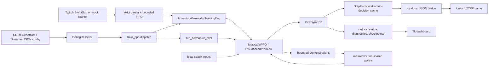

# PvZRL Agent Operating Guide

This file is the root operating contract for automated contributors. It applies to the whole repository. Read it before changing Python, C#, configuration, tests, documentation, model artifacts, or live-game state.

## 1. Maintained product boundary

Adventure Generalist is the sole maintained training and evaluation path. Legacy fixed/specialist mode was removed during the repository refactor.

PvZRL is a local Windows research and automation system for `PlantsVsZombiesRH`. Python owns MaskablePPO integration, Adventure progression, rewards, diagnostics, local coach inputs, artifacts, and the Tk dashboard. A MelonLoader C# bridge runs inside the bundled Unity/IL2CPP game and exposes localhost newline-delimited JSON commands.

Maintained here:

- Adventure Generalist fresh training, resume, evaluation, progression, and checkpoint compatibility;
- Streamer Mode V1 as a Twitch/mock FIFO intervention overlay on that same Generalist trainer/evaluator, including intervention-aware PPO, bounded demonstrations, masked BC, and baseline/current/best experiment roles;
- one permanent 14-slot identity action/observation contract;
- Gymnasium environment behavior, masks, action execution, fusion, rewards, lifecycle/reset handling, and diagnostics;
- local human-coach, mock crowd-coach, assisted-coach, and Tk dashboard workflows;
- a localhost-only C# bridge for observation, configuration, seed/UI automation, placement, fusion, reset, and runtime dispatch;
- JSON, JSONL, CSV, TensorBoard, checkpoint, status, and watchdog artifacts under ignored run directories;
- bridge-free regression tests, deterministic C# harnesses, and synthetic performance benchmarks.

Not implemented:

- no hosted API, production website, cloud control plane, public listener, or remote secret store;
- no guarantee that arbitrary game/mod/profile/checkpoint combinations are compatible;
- no alternate training/evaluation product path selected by level, seed count, or model schedule.
- no OBS automation/overlay, public Twitch control service, external game/OBS/Windows restart supervisor, or autonomous comparison branch.

Keep the system local and source-first. Do not introduce a service architecture to solve a local file, Tk, subprocess, or bridge problem unless the user explicitly changes the product boundary.

## 2. Authoritative repository map

| Area | Authoritative paths | Ownership and constraints |
| --- | --- | --- |
| Train/eval dispatch | `python/train_ppo.py`, `python/pvzrl_config.py`, `docs/CONFIGURATION.md` | Resolves CLI/JSON inputs and dispatches only Generalist train or Generalist eval. |
| Streamer cycles/checkpoints | `python/pvzrl_streamer.py`, Streamer entrypoints in `python/train_ppo.py` | Coordinates the existing Generalist train/eval functions, sequential Adventure-level handoff, exact policy-step cycles, and immutable BASELINE / atomic hash-addressed CURRENT / protected BEST roles. It is not another trainer or evaluator. |
| Streamer PPO/BC | `python/pvzrl_streamer_ppo.py`, `python/pvzrl_demonstrations.py` | Policy-only MaskablePPO rollouts, explicit intervention/GAE boundaries, same-policy masked BC, and bounded atomic demonstration persistence. Viewer actions must never be recorded with policy log probabilities. |
| Streamer input/actions | `python/pvzrl_streamer_source.py`, `python/pvzrl_twitch.py`, `python/pvzrl_stream_commands.py`, `python/pvzrl_stream_actions.py`, `python/pvzrl_streamer_logging.py` | Read-only Twitch EventSub or deterministic mock source, privacy-safe parsing, bounded FIFO/TTL/phase ownership, and current-frame resolution through canonical action decisions. No Twitch-specific gameplay logic. |
| Generalist runtime | `python/pvzrl_adventure_generalist.py`, `python/pvzrl_generalist_progression.py` | Training wrapper, startup validation, seed selection, replay/frontier state, and pure progression reduction. |
| Adventure orchestration | `python/pvzrl_adventure.py` | Evaluation attempts, transitions, timeout semantics, and live-status assembly. Generic filenames are retained shared infrastructure, not a separate supported mode. |
| Base environment | `python/pvzrl_env.py`, `python/pvzrl_lifecycle.py`, `python/pvzrl_runtime_state.py` | Bridge client, reset/state machine, action execution, lifecycle classification, and current frame/state. |
| SB3 adapter | `python/pvzrl_sb3.py` | Generalist Gym spaces, numeric observation, masks, coach arbitration, and episode accounting. |
| Action contract | `python/pvzrl_action_space.py`, `python/pvzrl_actions.py` | Sole 14-slot decoder, immutable intents/decisions/results, legality, and per-frame action-decision cache. |
| Observation contract | `python/pvzrl_observation_layout.py`, `python/pvzrl_observation_facts.py`, `python/pvzrl_seed_inventory.py` | Exact 4,297-wide observation and immutable per-frame facts. |
| Plant registry | `configs/plant_registry.json`, `python/pvzrl_registry.py`, `scripts/generate_bridge_registry.py`, `src/PvZRLBridge/GeneratedPlantRegistry.cs` | JSON is canonical for base plants; generated C# must not be edited by hand. |
| Fusion | `python/pvzrl_fusion.py`, execution adapter in `python/pvzrl_env.py`, `src/PvZRLBridge/BridgeMod.Fusion.cs` | Python predicts known recipes; the bridge/game is final legality and result authority. |
| Rewards/metrics | `python/pvzrl_rewards.py`, `python/pvzrl_lane_diagnostics.py`, `python/pvzrl_diagnostics.py`, `python/pvzrl_telemetry.py` | Pure reward composition, episode fields, diagnostics, and bounded/atomic artifact writes. |
| Metadata | `python/pvzrl_model_metadata.py` | Fail-fast compatibility for the maintained Generalist checkpoint family. |
| Coach inputs | `python/pvzrl_human_coach.py`, `python/pvzrl_stream_coach.py`, `python/pvzrl_assisted_coach.py`, `python/pvzrl_file_tail.py` | Local parsing, validation, precedence, aggregation, interventions, and partial-record-safe tailing. |
| Tk dashboard | `python/pvzrl_gui.py`, `python/pvzrl_gui_commands.py`, `python/pvzrl_gui_process.py`, `python/pvzrl_gui_status.py`, `python/pvzrl_gui_view.py`, `python/pvzrl_gui_coach.py` | Generalist train/resume/eval, model selection, diagnostics, and coach controls. The GUI consumes status; it does not own gameplay truth. |
| Bridge server | `src/PvZRLBridge/BridgeMod*.cs`, `BridgeServerTypes.cs`, `BridgeDtos.cs` | Local listener, request ownership/deadlines, DTOs, Unity-thread dispatch, and game operations. |
| Build/verification | `scripts/build_bridge.ps1`, `scripts/test_bridge_lifecycle.ps1`, `scripts/benchmark_bridge_observation.ps1` | Deterministic local build, lifecycle harness, and C# benchmark. |
| Tests/fixtures | `python/test_*.py`, `python/fixtures/refactor_contracts/` | Current executable compatibility truth. Update hashes/fixtures only after proving an intentional contract change. |
| Refactor record | `docs/REFACTOR_PLAN.md`, `docs/REFACTOR_REPORT.md` | Current gates, evidence, limitations, and remaining work. |
| Local game/artifacts | `Game Files/`, `runs/`, `python/runs/` | Workstation inputs and outputs. Treat profiles, models, logs, and installed DLLs as user data. |

## 3. Runtime flows



Fresh training creates a new MaskablePPO model. Resume explicitly loads a compatible Generalist checkpoint and writes only to the requested new run directory. Evaluation loads a compatible Generalist checkpoint and runs Adventure attempts without mutating the source checkpoint.

Streamer V1 adds an orchestrator around those exact entrypoints: autonomous BASELINE evaluation, `STREAM_TRAIN`, atomic CURRENT save, autonomous `EVALUATE`, deterministic BEST comparison, then resume from CURRENT. Streamer phases do not add supported run modes; underlying dispatch remains Generalist train/eval.

Action masks flow through `PvZMaskedPPOEnv.action_masks -> PvZGymEnv.action_mask -> PvZGymEnv._action_cache_for -> build_action_decision_cache`. Policy, coach, diagnostics, and execution reuse that proven decision set for the current frame/configuration.

Observation flow is bridge `BuildObservation -> PvZBridgeClient -> PvZGymEnv -> StepFactsCache -> PvZMaskedPPOEnv._encode_observation -> NumPy (4297,) -> MaskablePPO`.

Action flow is source-attributed intent -> cached legality decision -> policy/coach selection -> bridge request -> bridge/game validation -> structured result -> rewards and metrics. Policy IDs and bridge IDs are the same maintained flat identity.

## 4. Protected Generalist compatibility contract

The maintained policy board is exactly 5 rows by 10 columns with 14 permanent identity slots.

| Field | Required value |
| --- | --- |
| Model family | `ppo_adventure_generalist_14slot_identity_v1` |
| Action-space mode | `adventure_14slot_identity` |
| Action count | `701` |
| Wait action | `0` |
| Placement/fusion actions | `1..700` |
| Decoder | `seedslot14x50_plus_wait_v1` |
| Observation version | `adventure_14slot_identity_v1` |
| Observation shape | `(4297,)` |
| Max seed slots | `14` |
| Identity slots | `true` |

Action `1 + slot_index * 50 + row * 10 + column` selects one live identity slot and board cell. Inactive slot blocks stay masked. Do not resize this surface from the currently selected loadout or bridge `legalActionCount`.

The protected checkpoint is:

```text
runs/ppo_adventure_generalist_14slot_identity_v1_20260627_172727/checkpoints/ppo_pvz_370000_steps.zip
```

Its startup loadout intentionally preserves duplicates:

```text
SunFlower,SunFlower,Peashooter,Peashooter
[1,1,0,0]
```

Slot identity and order are model semantics. `dynamic_seed_slots=true` remains serialized metadata describing inventory capability; it does not name another decoder.

`pvzrl_model_metadata.py` must reject mismatches in metadata version, model family, action count/mode, decoder, observation version/shape, capacity/identity flags, wait action, placement range, geometry, or other maintained semantic fields. `MaskablePPO.load` remains the final bridge-free checkpoint proof.

## 5. Registry, fusion, and rewards

`configs/plant_registry.json` is authoritative for base plants, aliases, IDs, fallback metadata, training eligibility, and GUI presets. Live `CardUI` cost, cooldown, unlock, and availability remain runtime authority. Bridge builds regenerate `GeneratedPlantRegistry.cs` deterministically.

Verified recursive recipes:

- Peashooter `0` + Peashooter `0` -> DoubleShooer `1030`
- DoubleShooer `1030` + Peashooter `0` -> SplitPea `1090`
- SplitPea `1090` + Peashooter `0` -> GatlingPea `1032`
- SunFlower `1` + SunFlower `1` -> TwinFlower `1033`

`1031` is SunShroom. Runtime-only compatible pairs may be bridge-probed, but Python must not invent stable result IDs for them. Fusion may mutate only the requested source tile. Deduplicate attempts, outcomes, and rewards by event identity. Never count a bridge rejection as success.

Fusion policy values are `none`, `observe`, and `scripted`; `assist` is accepted as the scripted alias. Plant deletion is not a policy/manual action.

`RewardConfig`, `REWARD_COMPONENT_FIELDS`, `REWARD_EPISODE_TOTAL_FIELDS`, and `FUSION_REWARD_COMPONENT_NAMES` are serialized contracts. Preserve exact additive accounting and verify signs in the compositor before changing coefficients. Episode metrics, diagnostics, TensorBoard data, and status are additive surfaces; do not delete keys merely because one consumer appears inactive.

## 6. Progression, lifecycle, and reset

Startup validation compares wrapper-expected, bridge-detected, profile, UI, seed-selection, and gameplay identity. Conflicts fail fast with an inspectable `blocked_reason`; they are not permission to force a level.

Progression/frontier/replay decisions belong in `pvzrl_generalist_progression.py`. Side effects remain in the Generalist wrapper and Adventure runner. Loss, win, timeout, transition, reset, reward, unlock, seed selection, and gameplay ready are distinct states.

`python/pvzrl_lifecycle.py` owns pure lifecycle predicates. The environment reset state machine owns clicks, polling, guards, cleanup, and observation handoff. Do not bypass the active-wave safety guard because reset appears unresponsive. Soft timeouts may extend only under the configured final-wave policy; hard timeouts remain terminal.

Cleared-level sampling remains bounded by the live replay capability. If same-level or historical replay cannot be proven, retain the blocked/recovery reason rather than silently advancing or sampling a different level.

Streamer phases hand Adventure identity forward sequentially: configured `adventure_start_level` -> baseline evaluation `next_adventure_level` -> cycle training ending level -> current evaluation `next_adventure_level` -> next cycle. Persist the phase start/evaluation/next levels and use the existing strict identity diagnostics at each live boundary. If the profile advances past the last atomic CURRENT/state record after a crash, fail closed; do not silently adopt or force another level. Sequential evaluations may cover different live progression states and are not a same-level controlled experiment.

## 7. Status, GUI, and coaches

Live status is atomically replaced and normally throttled to a minimum 0.5-second interval. Terminal/significant changes force a write. `build_live_status`, Generalist runtime builders in `train_ppo.py`, `LiveStatusWriter`, and `LiveStatusReader` are the schema path.

Retain core status fields for run mode, health/state, blocked/done/terminal reasons, screen/wave/level/attempt/episode, action and observation contract, model compatibility, seed/loadout/capacity, timeout/reset/post-win, masks, fusion, watchdog, and coach data. Consumers migrate through normalized aliases; producers must not create competing gameplay truth.

Human coach precedence over mock crowd coach is intentional. With human coach enabled, mock input can be configured but not selected. Diagnose using `runs/live_status.json`, configured command paths, and coach JSONL output before changing precedence.

GUI buttons build argv and launch child processes. They do not call game operations directly. Stop/window-close must remain bounded. Coach actions append local queue records. Stream coach defaults to dry-run unless apply is explicitly selected.

### Streamer Mode V1 status and ownership

Streamer V1 is distinct from the legacy mock crowd-coach/voting path. It rejects simultaneous human/stream-coach action overrides and uses no voting. `StreamerMaskablePPO` supports one environment, collects exactly the configured number of policy-owned transitions, excludes viewer transitions and their log probabilities from the rollout buffer, bootstraps the adjacent policy segment, and starts a new GAE segment after Twitch. Only proven successful viewer executions enter the bounded demonstration store and masked BC loss.

Twitch is source-only: EventSub WebSocket `channel.chat.message` -> source buffer -> strict parser -> bounded FIFO -> two-second controller gate -> current mask/action-decision cache -> canonical environment execution. At each opportunity, drop expired/stale/illegal heads and execute at most the first currently legal command. Queue/source generations must clear across disconnects and phase changes so no old train/evaluation message can leak forward. Twitch unavailability must leave autonomous policy stepping non-blocking.

Persist only HMAC-SHA256 viewer hashes. Never persist raw Twitch user IDs, usernames, display names, raw chat, tokens, or the HMAC secret. Credential values come from configured environment-variable names. All viewer coordinates are one-based at the parser boundary and converted once to the maintained zero-based 5x10 / 14-slot action identity.

Evaluation has no Twitch controller, PPO update, or BC update. BASELINE remains immutable; CURRENT is the resume source even after a worse evaluation; BEST promotes only between protocol-compatible evaluations with the same Adventure start level, first on higher `win_rate`, then higher `avg_reward`, and retains the incumbent on an exact tie. Cross-level comparisons are `UNKNOWN`. Checkpoint/state/hash contradictions fail closed.

Extend normalized live status rather than creating a parallel overlay service. Preserve Streamer mode/cycle, policy and environment counters, queue/opportunity state, redacted Twitch connection/reconnect diagnostics, hashed-viewer count, last action/source, BC counts/loss, phase update gates, compact baseline/current/best evaluation, model steps, and sequential Adventure-level context. Do not serialize observations into live status.

## 8. Bridge contract

The bridge listens only on `127.0.0.1:32323` by default. One request and one response occupy one JSON line. Outer responses are `{"ok":true,"data":...}` or `{"ok":false,"error":"...","details":"..."}`. A command-specific `data.ok` is distinct from transport `ok`.

`BridgeMod.Commands.cs` is command authority. Maintained operations include observation/state probes, configuration, seed selection, placement, fusion, reset/recovery, Adventure UI actions, speed restoration, and the external-restart sentinel.

Unity work runs on the bridge update thread. Timeout/cancel may win only before dispatch owns a request; once dispatch starts, return its real completion. Shutdown must stop enqueue/registration, cancel queued work, close sockets, prevent later dispatch, and bound all joins.

Do not add a second protocol, a public listener, Python shadow DTO classes, or GUI socket code.

## 9. Configuration and artifacts

Resolution precedence is always:

```text
explicit CLI value > JSON configuration > Generalist mode default > global default
```

An argparse `None` means not supplied; explicit falsey values still win. `ResolvedRunConfig` is the immutable typed view. `build_config()` remains the flat-dictionary/artifact adapter. Do not add another resolver.

Resume never overwrites the source checkpoint. Each run writes its own resolved config, metadata, progress, logs, checkpoints, status, and diagnostics beneath its run directory. Treat ignored artifacts and local profiles as user data.

Streamer V1 is enabled only over the Generalist train run mode and requires a configured compatible baseline checkpoint. Defaults are 2.0-second FIFO opportunities, 10-second TTL, queue capacity 256, 25,000 policy steps/cycle, safe CURRENT saves every 5,000 policy steps, 50 autonomous evaluation episodes, demonstration capacity 4,096, and conservative BC coefficient 0.01. Streamer cycle steps must align exactly with `n_steps`; Streamer defaults are `n_steps=500`, `batch_size=50`. Twitch credential configuration stores environment-variable names only.

The Streamer experiment directory owns `streamer_state.json`, `streamer_cycles.jsonl`, compact rotating event JSONL, bounded compressed demonstrations, per-cycle train/eval artifacts, and BASELINE/CURRENT/BEST records. CURRENT/BEST retain two immutable generations; cycle evidence still grows with experiment duration and needs disk-retention monitoring. Logs must not contain full observations or raw viewer identity. See `docs/STREAMER_MODE.md` and `configs/streamer_v1.example.json`.

## 10. Development and verification

Run from the repository root in PowerShell using the prepared Windows Python environment.

Readiness and bridge-free gate:

```powershell
python .\python\train_ppo.py --check-deps
python -m compileall -q python
python -m pytest -q
```

Bridge gate:

```powershell
.\scripts\build_bridge.ps1
.\scripts\test_bridge_lifecycle.ps1
```

Protected checkpoint dry load:

```powershell
python .\python\train_ppo.py `
  --config configs\ppo_adventure_generalist_14slot_identity_v1.json `
  --metadata-dry-run `
  --model-path runs\ppo_adventure_generalist_14slot_identity_v1_20260627_172727\checkpoints\ppo_pvz_370000_steps.zip
```

Fresh train and resume forms:

```powershell
$run = 'runs\manual_generalist\fresh'
$resume = 'runs\manual_generalist\resume'
python .\python\train_ppo.py --config configs\ppo_adventure_generalist_14slot_identity_v1.json --adventure-generalist-train --run-dir $run --total-timesteps 512 --n-steps 128 --batch-size 64 --checkpoint-freq 128 --quick-wait --wait-gameplay-ready
python .\python\train_ppo.py --config configs\ppo_adventure_generalist_14slot_identity_v1.json --adventure-generalist-train --resume-model-path (Join-Path $run 'model.zip') --run-dir $resume --total-timesteps 512 --n-steps 128 --batch-size 64 --checkpoint-freq 128 --quick-wait --wait-gameplay-ready
```

Evaluation form:

```powershell
python .\python\train_ppo.py `
  --config configs\ppo_adventure_generalist_14slot_identity_v1.json `
  --adventure-generalist-eval `
  --model-path runs\ppo_adventure_generalist_14slot_identity_v1_20260627_172727\checkpoints\ppo_pvz_370000_steps.zip `
  --run-dir runs\manual_generalist\eval `
  --quick-wait --wait-gameplay-ready
```

Dashboard and benchmarks:

```powershell
python .\python\pvzrl_gui.py --live-status-path runs\live_status.json
python .\python\benchmark_hotpaths.py --samples 50 --rounds 5 --json-out runs\benchmarks\manual_python.json
.\scripts\benchmark_bridge_observation.ps1 -OutputPath runs\benchmarks\manual_bridge.json
```

Streamer bridge-free and live endurance forms:

```powershell
python .\python\pvzrl_streamer_soak.py --duration-hours 6 --report-path runs\streamer_soak\six_hour.json
python .\python\train_ppo.py --config configs\streamer_v1.example.json --streamer-v1 --run-dir runs\streamer_v1\live_six_hour --live-status-path runs\streamer_v1\live_six_hour\live_status.json --streamer-endurance-hours 6 --streamer-max-cycles 0 --quick-wait --wait-gameplay-ready
```

The synthetic soak is not a credentialed Twitch/game proof. The live endurance deadline is observed at a safe complete cycle boundary, so it can finish after the nominal six-hour mark. Inspect queue/demo bounds, reconnect/error counters, memory/disk, phase transitions, policy/BC/checkpoint counters, hashes, and stale-command evidence before accepting it.

Synthetic Python benchmarks do not measure Unity, socket latency, rollout SPS, or full Tk rendering. Record host/power state or interleave cases before making cross-run performance claims.

Live commands are stateful. Confirm the expected game/profile/screen before each one. Preserve hashes for the installed DLL, protected checkpoint/metadata, and profile before and after protected live work. `build_bridge.ps1 -CopyToMods` mutates the installed game and requires an explicit live-test workflow.

## 11. Working rules

- Read this file, the task brief, current code, and the relevant tests before editing.
- Classify a dependency as Generalist-required, shared, obsolete, or unclear before deleting it.
- Preserve shared environment, mask, fusion, reward, bridge, reset, coach, and diagnostics behavior.
- Do not reintroduce removed mode flags, branches, schedules, presets, fixtures, or compatibility shims. Version control is recovery.
- Keep generated registry output generated.
- Preserve user changes in dirty worktrees and keep patches scoped.
- Use `rg`/`rg --files` for discovery and `apply_patch` for source edits.
- Run focused tests while iterating, then the full suite.
- Bound claims to what was actually exercised. A process starting is not a completed episode; a synthetic benchmark is not live performance; a metadata check is not a bridge test.
- Do not expose secrets, tokens, cookies, or private profile contents in logs or reports.
- Treat Twitch text as untrusted: strict whitelist and range checks only; no shell, `eval`/`exec`, paths, dynamic imports, free-form bridge calls, or raw identity persistence.
- Keep Twitch work off the bridge/environment/Tk/PPO hot paths; use one bounded producer and explicit shutdown, and preserve autonomous stepping on disconnect.
- If required documentation is ignored, use the repository's explicit tracking policy before handoff so the requested deliverable is not silently lost.
