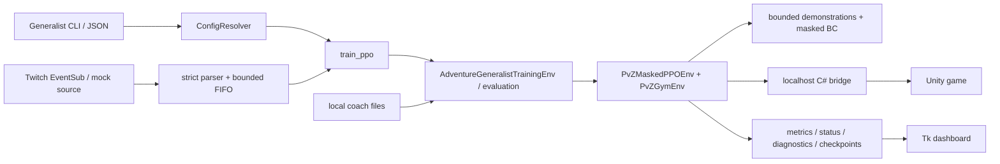

# PvZRL

PvZRL is a local Windows reinforcement-learning and automation system for `PlantsVsZombiesRH`. A MelonLoader C# bridge exposes structured Unity state on localhost; Python builds a Gymnasium environment and trains/evaluates a MaskablePPO Adventure policy.

Adventure Generalist is the sole maintained training and evaluation path. Legacy fixed/specialist mode was removed during the repository refactor.

## Maintained contract

| Item | Value |
| --- | --- |
| Model family | `ppo_adventure_generalist_14slot_identity_full_v2` |
| Run modes | `adventure_generalist_14slot_train`, `adventure_generalist_14slot_eval` |
| Action mode | `adventure_14slot_identity_full_v2` |
| Actions | 841: wait `0`, placement/fusion `1..840` |
| Decoder | `seedslot14x60_padded6x10_plus_wait_v2` |
| Observation | `adventure_14slot_identity_full_v2`, shape `(4364,)` |
| Board/capacity | fixed 6x10 model board, 14 identity slots; five-lane boards are padded |
| Initial loadout | `SunFlower,SunFlower,Peashooter,Peashooter` |
| Full Adventure | levels 1 through 50; fresh v2 training is required |

The action and observation spaces never resize with the current seed bank or live board height. Inactive slot blocks and the padded sixth row on five-lane boards remain encoded and masked. The historic v1 701-action/4,297-observation checkpoint is intentionally incompatible with this v2 contract, so it cannot be resumed or evaluated here.

## Features

- Adventure Generalist fresh training, compatible resume, and evaluation
- strict startup identity validation across wrapper, bridge, profile, UI, and gameplay
- unlock-aware seed curriculum and pure frontier/replay progression reducer
- one cached legality pipeline shared by policy, coaches, diagnostics, and execution
- tile-scoped known and runtime-probed fusion with recursive identity/reward tracking
- additive reward components, episode metrics, TensorBoard, live status, and watchdog bundles
- Twitch EventSub Streamer Mode V1 with strict FIFO commands, intervention-aware PPO, masked behavior cloning, autonomous evaluations, and protected BASELINE/CURRENT/BEST checkpoints
- a Tk control center for Generalist train/resume/eval, first-class Streamer V1, runs/models, diagnostics, settings, and explicitly separate local coach tools
- localhost-only Unity bridge with bounded request ownership/deadlines and reset/UI operations
- bridge-free Python tests, deterministic C# lifecycle harness, and synthetic benchmarks

Streamer Mode is a read-only Twitch input integration, not a hosted service or public game endpoint. The game bridge still binds to `127.0.0.1` by default.

## Requirements

- Windows
- a prepared Python environment with packages from `requirements-ppo.txt`
- the bundled `PlantsVsZombiesRH`/MelonLoader assemblies for bridge builds and live use
- workstation Visual Studio/.NET paths expected by the bridge scripts

Check the active Python environment:

```powershell
python .\python\train_ppo.py --check-deps
```

## Bridge-free verification

```powershell
python -m compileall -q python
python -m pytest -q
```

Validate the v2 contract before starting a fresh run:

```powershell
python .\python\train_ppo.py `
  --config configs\ppo_adventure_generalist_full_v2.json `
  --metadata-dry-run
```

Expected model contract: 841 actions and observation `(4364,)`. A CPU model-load check becomes available after the first v2 checkpoint is trained.

## Bridge build

```powershell
.\scripts\build_bridge.ps1
.\scripts\test_bridge_lifecycle.ps1
```

The build regenerates `src/PvZRLBridge/GeneratedPlantRegistry.cs` from `configs/plant_registry.json` and writes `src/PvZRLBridge/bin/Release/net6.0/PvZRLBridge.dll`.

`build_bridge.ps1 -CopyToMods` changes the installed game. Record the installed DLL hash first and restore or explicitly accept the result after protected live testing.

## Fresh training

Live commands are stateful. Select the intended profile and place the game at a clean Adventure boundary first.

```powershell
python .\python\train_ppo.py `
  --config configs\ppo_adventure_generalist_full_v2.json `
  --adventure-generalist-train `
  --run-dir runs\manual_generalist\fresh `
  --quick-wait --wait-gameplay-ready
```

## Resume

Resume loads a compatible Generalist model and must write to a different destination:

```powershell
python .\python\train_ppo.py `
  --config configs\ppo_adventure_generalist_full_v2.json `
  --adventure-generalist-train `
  --resume-model-path runs\manual_generalist\fresh\model.zip `
  --run-dir runs\manual_generalist\resume `
  --quick-wait --wait-gameplay-ready
```

## Evaluation

```powershell
python .\python\train_ppo.py `
  --config configs\ppo_adventure_generalist_full_v2.json `
  --adventure-generalist-eval `
  --model-path runs\manual_generalist\fresh\model.zip `
  --run-dir runs\manual_generalist\eval `
  --quick-wait --wait-gameplay-ready
```

Evaluation performs masked inference and Adventure progression orchestration; it does not update or overwrite the source model.

## Streamer Mode V1

Streamer Mode layers Twitch-controlled interventions and behavior cloning onto the same Adventure Generalist trainer and evaluator. It uses Twitch EventSub WebSocket `channel.chat.message`, a bounded FIFO with one opportunity every two seconds, and the canonical action/mask/fusion path. Viewer transitions change the game and enter the bounded demonstration dataset, but never masquerade as policy actions in the PPO rollout.

After training a v2 baseline, copy/edit the full-Adventure environment-variable-name example and set the real Twitch values only in the process environment:

```powershell
python .\python\train_ppo.py `
  --config .\configs\streamer_full_v2.example.json `
  --streamer-v1 `
  --run-dir .\runs\streamer_v1\live `
  --live-status-path .\runs\streamer_v1\live\live_status.json `
  --quick-wait --wait-gameplay-ready
```

The default loop evaluates the newly trained configured v2 baseline, trains for exactly 25,000 policy-generated steps with Twitch + BC, evaluates 50 autonomous episodes, compares against baseline/previous/BEST, then continues from CURRENT. Adventure levels are handed forward sequentially and validated against live profile/UI/bridge identity. OBS and all process/game startup remain manual.

Read [Streamer Mode V1](docs/STREAMER_MODE.md) for authentication, commands, privacy, PPO/GAE semantics, artifacts, recovery, known evaluation limitations, and six-hour endurance instructions.

## Dashboard

```powershell
python .\python\pvzrl_gui.py --live-status-path runs\live_status.json
```

The Tk control center has persistent pages for Dashboard, Training, Evaluation, Streamer, Runs & Models, Diagnostics, Local Coach, and Settings. Training, evaluation, and Streamer V1 forms validate before launch and show the exact backend command. Runs & Models indexes metadata and artifact provenance for an explicit operator selection; it never silently chooses a "latest" model. Streamer shows phase, queue/outcome counters, PPO/BC state, model roles, Adventure state, redacted Twitch health, and privacy-safe event history.

The GUI is generalized around the fixed 6-row x 10-column, 14-slot Full-Adventure contract. It launches `train_ppo.py` child processes and reads canonical status/artifacts; it does not call the bridge directly or create another gameplay truth. Twitch fields store environment-variable names and readiness only. Credential values are never displayed or saved. The local assisted/crowd-coach page is a separate legacy-compatible local input surface, not Streamer V1.

See [GUI control center](docs/GUI.md) for page ownership, launch workflows, compatibility checks, artifact provenance, lifecycle behavior, and status-source details.

## Architecture



## Repository map

| Path | Purpose |
| --- | --- |
| `python/train_ppo.py` | CLI/config resolution, training, resume, evaluation, artifacts |
| `python/pvzrl_adventure_generalist.py` | Generalist training wrapper and curriculum effects |
| `python/pvzrl_generalist_progression.py` | Pure frontier/replay/unlock reducer |
| `python/pvzrl_adventure.py` | Adventure evaluation, transitions, timeout, status |
| `python/pvzrl_env.py` | Bridge client, base environment, execution/reset boundary |
| `python/pvzrl_sb3.py` | Gymnasium/MaskablePPO adapter |
| `python/pvzrl_streamer.py`, `python/pvzrl_streamer_ppo.py` | Streamer cycles/checkpoint roles and intervention-aware PPO + BC |
| `python/pvzrl_twitch.py`, `python/pvzrl_streamer_source.py` | EventSub WebSocket and source-neutral command input |
| `python/pvzrl_stream_commands.py`, `python/pvzrl_stream_actions.py` | Strict FIFO commands and canonical current-state action resolution |
| `python/pvzrl_demonstrations.py`, `python/pvzrl_streamer_logging.py` | Bounded learning records and privacy-safe compact events |
| `python/pvzrl_action_space.py`, `python/pvzrl_actions.py` | 841-action full-Adventure contract and legality cache |
| `python/pvzrl_observation_*.py`, `python/pvzrl_seed_inventory.py` | 4,364-feature full-Adventure contract and facts |
| `python/pvzrl_fusion.py`, `python/pvzrl_rewards.py` | Fusion and reward composition |
| `python/pvzrl_gui*.py` | Tk control center, validated commands, bounded process/status/event handling, artifact indexing, and local coach support |
| `src/PvZRLBridge/` | MelonLoader bridge and Unity operations |
| `configs/ppo_adventure_generalist_full_v2.json` | Canonical full-Adventure run configuration |
| `configs/streamer_full_v2.example.json` | Safe Full-Adventure Streamer example with environment-variable names only |
| `scripts/` | Bridge generation/build/harness/benchmark scripts |

 synthetic. They do not measure Unity, Twitch delivery, socket latency, live rollout SPS, or complete Tk rendering.

## Safety and evidence

- Treat models, profiles, installed DLLs, and ignored run artifacts as user data.
- Never overwrite a resume/evaluation source checkpoint.
- Do not force Adventure progression when identity evidence disagrees.
- Do not put Twitch tokens, viewer-hash secrets, raw viewer identities, or raw chat in repository artifacts.
- Streamer evaluation is autonomous and sequential across live Adventure progression; it is not a same-level controlled comparison.
- The bridge/game is final placement/fusion authority.
- A metadata load is not a live-game test; a process start is not a rollout; a synthetic benchmark is not live performance.
- Preserve inspectable `blocked_reason`, rejection, timeout, reset, fusion, and reward evidence instead of summarizing failures away.
