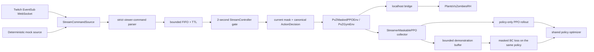

# Streamer Mode V1

Streamer Mode V1 is the maintained Adventure Generalist with a bounded Twitch command source and an intervention-aware PPO + behavior-cloning training overlay. It is not another game environment, action space, fusion implementation, or evaluator.

The product loop is:

```text
BASELINE EVALUATE
-> STREAM_TRAIN (Twitch + PPO + BC)
-> atomic CURRENT save
-> EVALUATE (autonomous only)
-> compare and optionally promote BEST
-> STREAM_TRAIN
```

OBS remains manual. V1 does not create an overlay UI, send chat messages, automate OBS, launch or restart the game, expose a web service, or supervise Windows processes.

## Architecture and ownership



The key implementation boundaries are:

- `pvzrl_streamer_source.py`: source-neutral message contract and deterministic source;
- `pvzrl_twitch.py`: read-only `channel.chat.message` EventSub WebSocket adapter;
- `pvzrl_stream_commands.py`: whitelist parser, bounded FIFO, TTL, cadence, phase ownership, and dedupe;
- `pvzrl_stream_actions.py`: current-frame resolution into the existing `ActionDecision`/`ActionIntent` path;
- `pvzrl_sb3.py`: canonical environment execution, result classification, compact event logging, and demonstration metadata;
- `pvzrl_streamer_ppo.py`: policy-only rollout collection, intervention boundaries, and masked BC;
- `pvzrl_demonstrations.py`: bounded, validated, atomic `.npz` demonstration storage;
- `pvzrl_streamer.py`: baseline/current/best roles and the train/evaluate cycle;
- `train_ppo.py`: configuration, compatibility checks, authoritative Generalist train/eval calls, status, and CLI dispatch.

The C# bridge is unchanged. Twitch never calls the bridge directly and contains no plant, fusion, reward, or progression rules.

## Safe example configuration

Start from [`configs/streamer_v1.example.json`](../configs/streamer_v1.example.json). Its checkpoint is repository-relative and points at the existing local 500k Adventure Generalist model; change it only to another compatible 500k path when the artifact is stored elsewhere. Streamer startup loads the model and applies the same 701-action, 4,297-observation metadata checks as other Generalist entrypoints.

The example intentionally contains environment-variable **names**, never their values. Do not put OAuth tokens or hashing secrets in JSON, shell history, logs, or source control.

Important V1 defaults are:

| Setting | Default |
| --- | ---: |
| Platform | `twitch` |
| Viewer opportunity interval | 2.0 seconds |
| Command TTL | 10.0 seconds |
| Parsed-command FIFO capacity | 256 |
| Maximum command length | 256 characters |
| Policy-generated steps per cycle | 25,000 |
| Safe CURRENT checkpoint interval | 5,000 policy steps |
| Autonomous evaluation episodes | 50 |
| Rollout / minibatch size | 500 / 50 |
| Demonstration capacity | 4,096 |
| BC coefficient | 0.01 |
| BC batch size | 32 |
| BC update frequency | every PPO training call |
| Minimum demonstrations before BC | 8 |

`streamer_policy_steps_per_cycle` must be divisible by `n_steps`, and `n_steps` must be divisible by `batch_size`. A Viewer intervention increments environment-action and intervention counters, but it does not increment the policy-step target.

`streamer_max_cycles=0` means no cycle-count limit. `streamer_endurance_hours=0` means no elapsed-time limit. If both are nonzero, the first limit observed at a safe cycle boundary stops the experiment.

## Twitch setup

V1 uses Twitch EventSub WebSocket transport and `channel.chat.message`; it does not use legacy IRC. Consult Twitch's current [chat overview](https://dev.twitch.tv/docs/chat/), [token validation requirements](https://dev.twitch.tv/docs/authentication/validate-tokens/), and [`channel.chat.message` subscription documentation](https://dev.twitch.tv/docs/eventsub/eventsub-subscription-types/#channelchatmessage) when creating credentials.

Install `requirements-ppo.txt`; it pins the supported `websockets` major version used by the EventSub client. `train_ppo.py --check-deps` checks the local PPO/Twitch imports, but it does not validate live Twitch network access or credentials.

Create a Twitch user access token for the EventSub reader with `user:read:chat`. The adapter validates that scope, the token's client ID, expiry, and—when explicitly configured—the token user ID. For the simplest local deployment, use the broadcaster or one of the broadcaster's moderators as the EventSub reader. If another account is used, satisfy any additional Twitch channel authorization requirements before starting; V1 does not grant roles or manage OAuth consent.

Set these values in the process environment:

| Default environment variable | Meaning |
| --- | --- |
| `PVZRL_TWITCH_CLIENT_ID` | Client ID belonging to the token |
| `PVZRL_TWITCH_USER_ACCESS_TOKEN` | User access token, without an `OAuth ` or `Bearer ` prefix |
| `PVZRL_TWITCH_BROADCASTER_USER_ID` | Numeric ID of the channel being read |
| `PVZRL_TWITCH_EVENTSUB_USER_ID` | Optional reader/token user ID; if set, it must match token validation |
| `PVZRL_TWITCH_VIEWER_HASH_SECRET` | Private 16–4,096-byte HMAC secret used for stable viewer hashes |

The JSON keys ending in `_env` may point to differently named environment variables. The configured names themselves must be present for client ID, access token, broadcaster ID, and the hash secret. The EventSub user ID value remains optional.

PowerShell setup should source the real values from a password manager or another local secret mechanism:

```powershell
$env:PVZRL_TWITCH_CLIENT_ID = '<secret-store value>'
$env:PVZRL_TWITCH_USER_ACCESS_TOKEN = '<secret-store value>'
$env:PVZRL_TWITCH_BROADCASTER_USER_ID = '<secret-store value>'
$env:PVZRL_TWITCH_VIEWER_HASH_SECRET = '<at least 16 random bytes/characters>'
# Optional; omit/unset it to use the user ID returned by token validation.
# $env:PVZRL_TWITCH_EVENTSUB_USER_ID = '<token user id>'
```

Do not commit those assignments. The adapter holds raw Twitch user IDs only long enough to derive `HMAC-SHA256(secret, twitch_user_id)`. Persisted Streamer records use the 64-character hash; event logging removes raw user IDs, usernames, display names, and raw chat fields defensively.

The adapter validates the token, opens one background EventSub connection, waits for the welcome frame, and creates the subscription for that session. It handles keepalive timeout, Twitch-requested reconnect handoff, ordinary disconnect/reconnect with bounded backoff, duplicate deliveries, malformed frames, revocation, and graceful shutdown. At-least-once deliveries are deduplicated by bounded transport-delivery and chat-message/event identifiers before the parsed FIFO. Network callbacks only enqueue bounded source messages. They never mutate the game.

If Twitch disconnects, both the source buffer and parsed-command generation are invalidated. Autonomous model actions continue without waiting. Reconnection opens a new generation; pre-disconnect commands cannot execute afterward. Missing environment configuration fails startup. A terminal authorization/revocation state disables Twitch input and is exposed in status; V1 does not refresh OAuth tokens, so correct the credential and restart the Streamer process.

## Supported viewer commands

Viewer syntax is ASCII-only, case-insensitive, and strictly whitelisted. Rows, columns, and slots are **one-based** at the viewer boundary:

- rows: `1..5`;
- columns: `1..10`;
- seed slots: `1..14`.

The parser converts each value to the internal zero-based index exactly once. Examples:

| Command | Meaning |
| --- | --- |
| `!plant sunflower 2 4` | Resolve `sunflower` through the canonical plant registry and plant it at row 2, column 4. |
| `!slot 3 2 4` | Use current identity slot 3 at row 2, column 4. |
| `!fuse gatlingpea 3 5` | Request the canonical recipe whose result is GatlingPea at row 3, column 5. |
| `!fuse 3 5` | Request the first currently legal fusion at row 3, column 5. |

Plant aliases come from `configs/plant_registry.json`. Fusion-result names and recipes come from `pvzrl_fusion.py`; the parser does not maintain a second recipe table. Candidate actions are considered in permanent action-ID order, so tile fusion and duplicate-slot choices are deterministic.

Everything else is rejected or ignored: free-form chat, unsupported commands, extra arguments that do not form a canonical name, invalid ranges, control/non-ASCII text, overlong messages, shell-like text, paths, and code fragments. Viewer text is never used in `eval`, `exec`, a dynamic import, a filesystem operation, a subprocess, or an arbitrary bridge request.

## FIFO and two-second semantics

There is no vote aggregation in V1. Accepted commands retain arrival order. When the queue is full, the newest delivery is rejected; an accepted older command is not evicted.

At each monotonic opportunity:

1. the source is polled without blocking the environment;
2. expired or wrong-generation commands are removed;
3. the command at the head is resolved again against the current observation, current 701-wide mask, and current cached action decisions;
4. an illegal, stale, or unresolvable head is logged and removed, then the scan continues;
5. the first currently legal command is selected and at most one viewer action executes;
6. later unexpired commands stay in FIFO order for the next opportunity.

If no command is usable, the already-proposed Generalist action executes immediately. A late game step opens one opportunity; the controller does not burst through missed two-second windows. Sun, cooldown, occupancy, fusion state, lifecycle, frame identity, mask consistency, and current loadout are rechecked at execution time rather than trusted from arrival time.

## Intervention-aware PPO

`StreamerMaskablePPO` supports one Generalist environment and fills every rollout with policy-controlled transitions only. The model may propose `a_model` before the environment chooses a legal queued Twitch action, but a viewer-controlled result is explicitly classified in `info["streamer_transition"]` and is never inserted with the model action or model log probability.

For a viewer action:

- the transition changes the real game state;
- the viewer transition is omitted from the PPO rollout buffer;
- the preceding policy segment is bootstrapped from the value of the pre-viewer state;
- the next policy transition begins a fresh GAE segment from the post-viewer observation;
- termination/reset bookkeeping still runs;
- collection continues until the rollout contains exactly `n_steps` policy transitions.

The collector fails closed if an override appears without the explicit transition contract, if the executed policy action differs from the sampled action, or if a policy-only rollout cannot be proven full. This is why Streamer Mode cannot be implemented as a stock `env.step()` action replacement.

## Behavior cloning and demonstrations

Only a viewer action whose canonical action ID matches the bridge-reported executed action **and** whose plant/fusion effect is proven successful becomes a positive demonstration. Rejected, expired, stale, masked, ambiguous, bridge-error, or no-effect commands remain analysis events but never enter BC.

Each retained record copies:

- the exact model-facing float32 observation and observation revision/version;
- the exact 701-wide action mask used for execution;
- the canonical executed action;
- level, episode, environment step, training cycle, hashed viewer, command/event IDs;
- structured command and canonical resolution metadata;
- reward/result metadata and a later episode outcome when available.

The in-memory store is a bounded FIFO/ring. It is persisted atomically as compressed NumPy data at:

```text
<experiment>/demonstrations/viewer_demonstrations.npz
```

No pickle loading is used. Persistence happens in batches and at model save/close boundaries. Resume validates observation shape and action count and restores retained demonstrations and BC RNG/counters.

BC uses the existing masked policy distribution and optimizer. It minimizes masked negative log probability for the demonstrated action and adds `streamer_bc_coefficient * BC_loss` to the signed PPO loss. There is no separate policy head. `streamer_bc_enabled=false` disables BC optimizer contributions but still retains eligible demonstrations for later research/resume. Metrics include policy/value/entropy loss, BC loss/coefficient/update count, demonstration count, and sampled policy agreement.

## Train/evaluate cycle and Adventure progression

Before cycle 1, Streamer Mode evaluates the untouched baseline for exactly the configured number of completed autonomous episodes. Twitch, PPO updates, and BC updates are absent during evaluation. The training controller is shut down at the end of each train invocation, and a new source starts for the next train phase, so evaluation chat cannot accumulate into a later queue.

Adventure state is handed forward sequentially:

1. baseline evaluation starts at configured `adventure_start_level` after strict live identity validation;
2. its `next_adventure_level` becomes cycle 1's training start;
3. the training cycle's ending/current level becomes that cycle evaluation's start;
4. evaluation's `next_adventure_level` becomes the next training cycle's start.

Cycle records retain the start, evaluation, and next Adventure levels. The wrapper, bridge, profile, UI, seed-selection, and gameplay identities remain authoritative. If a crash advances the live profile beyond the last atomic CURRENT/state record, resume fails closed with an inspectable mismatch; do not bypass validation or guess a level.

This is a sequential Adventure experiment, not a same-level paired benchmark. Baseline and later checkpoint evaluations can cover different progression states because evaluation itself advances the live profile. Comparisons are useful operational Streamer metrics but are not a controlled causal estimate. V1 does not snapshot/restore profiles or run the future autonomous continuation control branch.

One cycle advances by exactly 25,000 policy-generated timesteps. Viewer interventions and total environment actions are separate counters. CURRENT is also saved after safe optimizer updates at the configured 5,000-policy-step interval so an interrupted cycle can resume only its remaining policy steps.

## BASELINE, CURRENT, and BEST

| Role | Contract |
| --- | --- |
| BASELINE | Configured source checkpoint. Its absolute path, SHA-256, and metadata hash are captured. The source is never overwritten and its hash is rechecked. |
| CURRENT | Active Streamer model, metadata, training counters, and cycle record under `<experiment>/checkpoints/current/`. Each save materializes an immutable hash-addressed version, then atomically replaces the authoritative role record. The conventional `current/model.zip` is a repairable compatibility alias. Training always continues from CURRENT. |
| BEST | Highest protocol-comparable autonomous evaluation observed. Immutable hash-addressed version data and an atomic role record protect promotion; a worse, tied, or non-comparable model cannot replace it. The conventional `best/model.zip` is a repairable alias. |

Promotion order is fixed for protocol-comparable evaluations: higher autonomous `win_rate`, then higher `avg_reward`; an exact tie retains the incumbent. Because V1 hands Adventure progression forward rather than restoring a profile snapshot, evaluations with different Adventure start levels are recorded as `UNKNOWN` comparisons and cannot promote BEST. Cycle records compare CURRENT with baseline, the prior CURRENT evaluation, and BEST-before-promotion only when their evaluation protocol and start level match. A worse or non-comparable CURRENT is not rolled back.

The first successful baseline evaluation is immutable experiment evidence and is reused only when its baseline SHA-256 and evaluation protocol match. If an existing experiment's protocol has changed, or an in-progress baseline marker shows that a crash may have advanced the live profile, resume blocks instead of re-running the baseline against a different state. Cycle evaluation cache keys include the CURRENT hash, cycle, protocol, and Adventure start level. Missing or contradictory state/checkpoint records fail closed rather than silently relabeling a model.

## Startup and resume

1. Install/check dependencies: `python .\python\train_ppo.py --check-deps`.
2. Start PvZ and confirm the intended profile is at the clean Adventure boundary represented by `adventure_start_level`.
3. Build/install the bridge only through the repository's normal bridge workflow; do not mutate a protected install casually.
4. Configure OBS manually if streaming video.
5. Set the Twitch environment variables above.
6. Start Streamer Mode:

```powershell
python .\python\train_ppo.py `
  --config .\configs\streamer_v1.example.json `
  --streamer-v1 `
  --run-dir .\runs\streamer_v1\live `
  --live-status-path .\runs\streamer_v1\live\live_status.json `
  --quick-wait --wait-gameplay-ready
```

Resume by running the same command with the same experiment directory and baseline. Do not pass CURRENT through the ordinary `--resume-model-path` workflow; the Streamer cycle manager owns CURRENT/state reconciliation.

For a finite smoke, add `--streamer-max-cycles 1`. `streamer_max_cycles=0` is intentionally open-ended.

### Deterministic mock source

`--streamer-platform mock --streamer-mock-script <path>` replaces Twitch only at the source boundary. A JSONL record may supply `command`, `event_id`/`delivery_id`, and either a precomputed 64-hex `viewer_hash` or a local-only `local_viewer_id`. The latter is hashed with the configured secret and therefore still requires `PVZRL_TWITCH_VIEWER_HASH_SECRET`. Mock scripts are limited to 100,000 input lines and 4,096 characters per line.

Example line:

```json
{"command":"!plant sunflower 2 4","local_viewer_id":"synthetic-viewer-1","event_id":"mock-event-1"}
```

Do not confuse Streamer V1's FIFO mock source with the older mock crowd-coach/voting subsystem. Streamer V1 rejects simultaneous legacy human- or stream-coach action overrides.

## Artifacts

Given `<experiment>` as `run_dir`, the durable layout is:

```text
<experiment>/
  streamer.log
  streamer_state.json
  streamer_cycles.jsonl
  checkpoints/
    baseline.json
    current/model.zip
    current/model_metadata.json
    current/streamer_checkpoint.json
    current/versions/...
    best/model.zip
    best/model_metadata.json
    best/streamer_checkpoint.json
    best/versions/...
  demonstrations/viewer_demonstrations.npz
  evaluations/baseline/evaluation.json
  cycles/cycle_000001/train/...
  cycles/cycle_000001/evaluation/evaluation.json
  logs/streamer_events.jsonl
  live_status.json                 # when the startup command above is used
```

`streamer_events.jsonl` contains compact parsed command outcomes and executed decisions, including action source, canonical action, reward, and existing reward components. It does not contain full observations or raw chat identity. The demonstration `.npz` is the separate learning artifact that contains observations.

The compact event log is buffered and rotates at 64 MiB with three backups. The cycle JSONL and per-cycle train/evaluation metrics remain append-only experiment evidence, so provision and monitor disk space for long runs. CURRENT and BEST retain the active and immediately prior immutable generations; redundant per-cycle source models are removed only after CURRENT commits safely. Demonstrations are bounded in memory and persisted atomically in batches. Checkpoints, demonstrations, profiles, and logs are user data.

## Overlay-ready live status

Streamer fields extend the normalized atomic live-status document. Important fields include:

- `streamer_v1_enabled`, `streamer_mode`, `streamer_cycle`, `streamer_platform`;
- `current_model_ppo_steps`, `baseline_model_ppo_steps`, `cycle_policy_steps_completed`, `next_evaluation_countdown`;
- `adventure_start_level`, `next_adventure_level`, and the persisted cycle start/evaluation/next-level context;
- `viewer_command_queue_depth`, `streamer_command_next_opportunity_monotonic`, queue counters, `last_viewer_action`, `last_action_source`, and `viewer_intervention_count`;
- `distinct_hashed_viewer_count` and its saturation flag;
- `twitch_connection_state`, network/phase gates, keepalive/reconnect/dedupe counters, subscription state, and redacted diagnostic code;
- `evaluation_chat_control`, `ppo_updates_enabled`, `bc_updates_enabled`, `bc_demonstration_count`, `bc_loss`, and `bc_update_count`;
- compact `baseline_evaluation`, `current_evaluation`, `best_evaluation`, and `best_model_steps`.

Status contains no raw observation vector or credential. `STREAM_TRAIN` and `EVALUATE` are overlay phases; the underlying maintained run modes remain `adventure_generalist_14slot_train` and `adventure_generalist_14slot_eval`.

## Verification

Ordinary tests use mocks and require no Twitch credential or live game:

```powershell
$env:PYTHONPATH = 'python'
python -m pytest -q `
  python\test_streamer_commands.py `
  python\test_streamer_actions.py `
  python\test_twitch_eventsub.py `
  python\test_streamer_ppo.py `
  python\test_streamer_bc.py `
  python\test_streamer_cycles.py
```

Then run the repository gates:

```powershell
python .\python\train_ppo.py --check-deps
python -m compileall -q python
python -m pytest -q
```

The focused suite covers EventSub lifecycle/dedupe/reconnect, grammar and injection rejection, FIFO/TTL/phase transitions, canonical plant/fusion resolution, on-policy rollout ownership and GAE boundaries, masked BC/bounded persistence, checkpoint roles/resume, and train/evaluate isolation. These remain bridge-free proofs unless a run explicitly starts the game.

## Six-hour endurance target

The bridge-free six-hour source/controller soak command is:

```powershell
python .\python\pvzrl_streamer_soak.py `
  --duration-hours 6 `
  --report-path runs\streamer_soak\six_hour.json
```

That command is safe for high-volume source/queue/concurrency and memory checks, but it is not a Twitch credential, Unity, socket-latency, PPO-rollout, or OBS proof.

For the real local game/Twitch endurance target, first perform the startup checks above, then run:

```powershell
python .\python\train_ppo.py `
  --config .\configs\streamer_v1.example.json `
  --streamer-v1 `
  --run-dir .\runs\streamer_v1\live_six_hour `
  --live-status-path .\runs\streamer_v1\live_six_hour\live_status.json `
  --streamer-endurance-hours 6 `
  --streamer-max-cycles 0 `
  --quick-wait --wait-gameplay-ready
```

The elapsed-time deadline is checked between complete train/evaluate cycles, so the process stops at the first safe cycle boundary at or after six hours rather than interrupting an episode or optimizer update exactly at 6:00:00.

Afterward inspect:

- `streamer_state.json`: complete cycle transitions, stop reason, model/policy steps, and current/best references;
- `streamer_cycles.jsonl`: exact 25k policy-step cycles, environment actions, interventions, BC losses/updates, evaluation comparisons, and checkpoint writes;
- `live_status.json`: queue depth, Twitch connection/reconnect/dedupe counters, next opportunity/evaluation countdown, and update gates;
- `logs/streamer_events.jsonl`: no post-phase stale execution, unexpected error/rejection spikes, or leaked identities;
- `demonstrations/viewer_demonstrations.npz`: retained count never above configured capacity and no shape/action incompatibility;
- CURRENT/BEST records and hashes: every referenced model exists and BEST never regresses;
- process memory and disk use: no monotonic memory leak, deadlock, or unexplained log/checkpoint growth.

Acceptance requires bounded queue/demo counts, continued policy steps while chat is quiet or disconnected, successful evaluation transitions, no off-policy contamination exception, no corrupt checkpoint/state record, and no credential or raw viewer identity in artifacts. A full live six-hour run is workstation evidence and is not implied by bridge-free tests or a shorter soak.

## Known limitations and non-goals

- Evaluation is sequential across live Adventure progression, not profile-restored or same-level paired evaluation.
- V1 has no autonomous continuation/control branch, so improvement comparisons are not causal treatment estimates.
- `StreamerMaskablePPO` supports exactly one environment.
- OAuth token acquisition and refresh are external; terminal auth failure requires operator correction/restart.
- Console and event logs rotate at bounded sizes; cycle evidence remains append-only. Persistent Windows/OneDrive file locks can delay best-effort checkpoint-version pruning, so monitor the experiment directory during long runs.
- The live game, bridge, profile, Twitch, and OBS still require operator setup. There is no external restart supervisor.
- There is no Twitch reply bot, IRC fallback, YouTube adapter, channel-points/donation privilege, free-form/LLM command parser, viewer ranking, public service, remote control plane, website, OBS overlay, OBS automation, or Streamer GUI redesign.
- A bridge-free soak or model load does not prove a six-hour credentialed live-game session. Record the exact commands, hashes, profile/screen state, host/power state, and resulting artifacts for any live acceptance claim.
